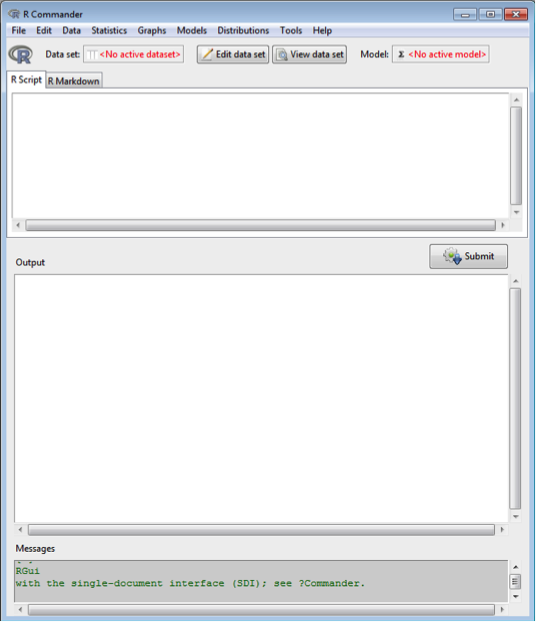

Please go throught the following steps to ensure that you have the correct software installed on your laptop

#Windows PC

1. Download the latest version of 'R' from [here](http://cran.r-project.org/bin/windows/base/R-3.1.1-win.exe). Install onto your laptop, accepting the default options.

2. Download the latest version of 'RStudio Desktop' from [here](http://download1.rstudio.org/RStudio-0.98.1079.exe) and install onto your laptop, accepting the default options

3. Load RStudio 


Once loaded, type the following in the 'Console' in the bottom-left where the 'blinking' cursor is; 

```{r echo=FALSE}
options(repos = "http://mirrors.ebi.ac.uk/CRAN/")
```


```{r}
install.packages("Rcmdr")
```

4. You should now be able to load 'R commander'

```{r eval=FALSE}
library(Rcmdr)
```

The R commander screen should now load 


#Mac OSX

1. Download the latest version of 'R' from [here](http://cran.r-project.org/bin/macosx/R-3.1.1-snowleopard.pkg). Install onto your laptop, accepting the default options.

2. Download the latest version of 'RStudio Desktop' from [here](http://download1.rstudio.org/RStudio-0.98.1079.dmg) and install onto your laptop, accepting the default options

3. Load RStudio 


Once loaded, type the following in the 'Console' in the bottom-left where the 'blinking' cursor is; 

```{r}
install.packages("Rcmdr")
```

4. You should now be able to load 'R commander'

```{r eval=FALSE}
library(Rcmdr)
```

The R commander screen should now load 

