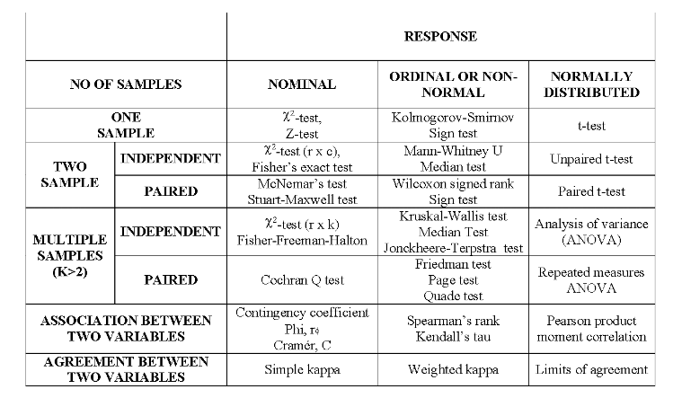
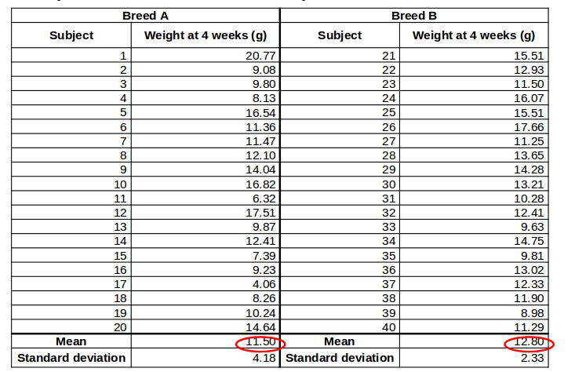
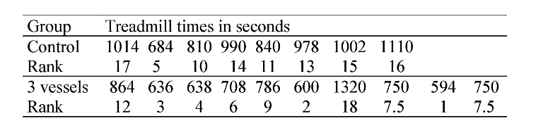
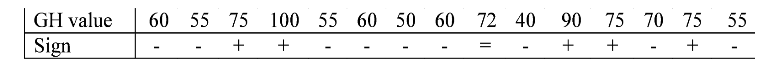
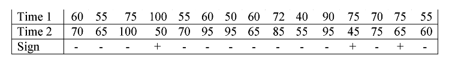

```{r setup, include=FALSE}
knitr::opts_chunk$set(comment = NA,echo=FALSE,message=FALSE,warning = FALSE)
```

# Introduction

## ~ Timetable

- 10.30 - 11.15 – Lecture: Introduction to Statistical analysis
- 11.15 - 11.30 – Quiz: Variables/Dependencies/Tests/Generalisability
- 11.30 - 12.00 – Lecture: Parametric Tests for Continuous Variables; t-tests
- 12.00 - 12.30 – Examples/Practicals (computer based)
- 12.30 - 13.30 – Lunch (not provided)
- 13.30 - 14.00 – Lecture: Non-parametric tests for continuous variable
- 14.00 - 14.30 – Examples/Practicals (computer based)
- (14:30 COFFEE)
- 14.30 - 14.45 – Lecture: Tests for Categorical Variables
- 14.45 - 15.30 – Examples/Practicals/Solutions (computer based)
- 15.30 - 16.25 – Group based exercise: Choosing appropriate tests
- 16.25 - 16.30 – Summary


## The point of statistics

- Rarely feasible to study the whole population that we are interested in, so we take a sample instead
- Assume that data collected represents a larger population
- Use sample data to make conclusions about the overall population


## Beginning a study

- Which samples to include?
    + Randomly selected?
    + Generalisability
- Always think about the statistical analysis
    + Randomised comparisons, or biased?
    + Any dependency between measurements?
    + Data type?
    + Distribution of data?  (Normally distributed? Skewed? Bimodal?...)
    
## Generalisability

- How samples are selected affects interpretation
    + What is the population that the results apply to?
    + How widely applicable will the study be?
- Statistical methods assume random samples
- Do not extrapolate beyond range of the data
    + i.e. don’t assume results apply to anything not represented in the data
- Examples: 
    + Males only, no idea about females
    + Adults only, no idea about children
    + 1 litter of mice, no idea about other litters

## Data types

- Several different categorisations
- Simplest:
    + Categorical (nominal) 
    + Categorical with ordering (ordinal)
    + Discrete
    + Continuous

## Nominal


<!----http://www.boredpanda.com/donald-trump-hair-look-alikes-->

- Most basic type of data
- Three requirements:
    + Same value assigned to all the members of level
    + Same number not assigned to different levels
    + Each observation only assigned to one level
- Boils down to yes/no answer
- e.g. Surgery type, smoker / non-smoker, eye colour, dead/alive, ethnicity.

## Ordinal


- Mutually exclusive fixed categories
- Implicit order
- Can say one category higher than another
    + But not how much higher
- Example: stress level 1 = low … 7 = high
- Others: Grade, stage, treatment response, education level, pain level.

## Discrete


- Fixed categories, can only take certain values
- Like ordinal but with well-defined distances
    + Can be treated as continuous if range is large
- Anything counted (cardinal) is discrete 
    + *how many*?
- Examples: number of tumours, shoe size, hospital admissions, number of side effects, medication dose, CD4 count, viral load, reads.

## Continuous


- Final type of data
- Anything that is measured, can take any value
- May have finite or infinite range
- Zero may be meaningful: ratios, differences
    + Care required with interpretation
- Given any two observations, one fits between
- Examples: Height, weight, blood pressure, temperature, operation time, blood loss, age.

## Data types

- Several different categorisations
- Simplest:
    + Categorical (nominal) – yes/no
    + Categorical with ordering (ordinal) – implicit order
    + Discrete – only takes certain values; counts (cardinal) 
    + Continuous – measurements; finite/infinite range
    
## Measurements: Dependent / Independent?

- Measurements of gene expression taken from each of 20 individuals
- Are any measurements more closely related than others?
    + Siblings/littermates? 
    + Same individual measured twice? 
    + Batch effects? 
- If no reason, assume independent observations

## Continuous Data - Distribution


```{r fig.width=12}
library(ggplot2)
library(gridExtra)
p1 <- ggplot(data.frame(x=c(-4,4)),aes(x)) + stat_function(fun=dt, args=list(df=10))
p2 <- ggplot(data.frame(x=rnorm(1000)),aes(x)) + geom_histogram() 
p3 <-  ggplot(data.frame(x="x",y=rnorm(1000)),aes(x,y)) + geom_boxplot()
grid.arrange(p1,p2,p3,ncol=3)
```

## Continuous Data - Distribution?

```{r message=FALSE}

df <- data.frame(group = c(rep("WT", 50), rep("KO",50)), count = c(rnorm(50,5,3), rnorm(50,4,2)))
p1 <- ggplot(df, aes(x=count)) + geom_histogram(fill="steelblue",col="gray") + facet_wrap(~group)

df <- data.frame(group = c(rep("WT", 50), rep("KO",50)), count = c(rnorm(50,400,20), rnorm(50,300,30)))
p2 <- ggplot(df, aes(x=group,y=count)) + geom_boxplot(fill="steelblue")

df <- data.frame(x=rbeta(1000,2,5))
p3 <- ggplot(df, aes(x)) + geom_histogram(fill="steelblue",col="gray")

df <- data.frame(x=rnorm(10,2,5))
p4 <- ggplot(df, aes(x)) + geom_histogram(fill="steelblue",col="gray")
grid.arrange(p1,p3,p2,p4,ncol=2)

```

## Continuous Data - Descriptive Statistics

- Measures of location and spread

```{r fig.height=5,fig.width=5}
ggplot(data.frame(x=c(-4,4)),aes(x)) + stat_function(fun=dt, args=list(df=10))
```

- Mean and standard deviation

$\bar{X} = \frac{X_1 + X_2 + \dots X_n}{n}$
$s.d = \sqrt{\frac{1}{N-1} \sum_{i=1}^N (x_i - \overline{x})^2}$

## Continuous Data - Descriptive Statistics

```{r fig.height=5,fig.width=5}

df <- data.frame(x=rbeta(10000,2,5))
ggplot(df, aes(x)) + geom_histogram(fill="steelblue",col="gray")
```

- Median: middle value
- Lower quartile: median bottom half of data
- Upper quartile: median top half of data

## Continuous Data - Descriptive Statistics (Example)

- e.g. No of Facebook friends for 7 colleagues
    + 311, 345, 270, 310, 243, 5300, 11
- Mean and standard deviation

    $\bar{X} = \frac{X_1 + X_2 + \dots X_n}{n} = 970$
    
    $s.d = \sqrt{\frac{1}{N-1} \sum_{i=1}^N (x_i - \overline{x})^2}=1912.57$
    
- Median and Interquartile range
    + 11, **243**, 270, ***310***, 311, **345**, 5300
    
## Continuous Data - Descriptive Statistics (Example)

- e.g. No of Facebook friends for 7 colleagues
    + 311, 345, 270, 310, 243, ***530***, 11
- Mean and standard deviation

    $\bar{X} = \frac{X_1 + X_2 + \dots X_n}{n} = 289$
    
    $s.d = \sqrt{\frac{1}{N-1} \sum_{i=1}^N (x_i - \overline{x})^2}=153.79$
    
- Median and Interquartile range
    + 11, **243**, 270, ***310***, 311, **345**, 5300    
    
## Continuous Data - Descriptive Statistics (Example)

- e.g. No of Facebook friends for 7 colleagues
    + 311, 345, 270, 310, 243, ***530***, 11
- Mean and standard deviation: ***low breakdown point***

    $\bar{X} = \frac{X_1 + X_2 + \dots X_n}{n} = 289$
    
    $s.d = \sqrt{\frac{1}{N-1} \sum_{i=1}^N (x_i - \overline{x})^2}=153.79$
    
- Median and Interquartile range: ***robust to outliers***
    + 11, **243**, 270, ***310***, 311, **345**, 5300    
  
## Categorical data

- Summarised by counts and percentages
- Examples
    + 19/82 (23%) subjects had Grade IV tumour
    + 48/82 (58%) subjects had Diarrhoea as an Adverse Event
    
```{r}
ggplot(data.frame(Grade=c("","I","II","IV"), Frequency=c(25,2,15,30)),aes(x=Grade,y=Frequency)) + geom_bar(stat="identity",fill="steelblue")
```


## Standard Deviation and Standard Error

- Commonly confused

- Standard deviation:
    + Measure of spread of the data

- Standard error:
    + Variability of the mean from repeated sampling
    + Precision of mean
    + Used to calculate confidence interval
    
- SD: How widely scattered measurements are

- SE: Uncertainty in estimate of sample mean

## Confidence intervals for the mean

- Confidence interval (CI) is a random interval
- In repeated experiments…
    + 95% of time CI covers the mean
- The mean should be in the CI 95% of the time

95% CI: $(\bar{X}-1.96 \times SE,\bar{X} + 1.96 \times SE)$

SE: $$\frac{sd}{\sqrt{n}} $$

## Confidence intervals for the mean

- Confidence interval (CI) is a random interval
- In repeated experiments…
    + 95% of time CI covers the mean
- The mean should be in the CI 95% of the time

95% CI: $(\bar{X}-1.96 \times SE,\bar{X} + 1.96 \times SE)$

SE: $$ \frac{sd}{\sqrt{n}} = \frac{154}{\sqrt{7}} = 58 $$

Facebook data: 11, 243, 270, ***310***, 311, 345, 530

Mean: 289, 95% CI (175, 402)

## Confidence Intervals


## Hypothesis tests - basic setup

- Formulate a null hypothesis, $H_0$
    + Example: the difference in gene expression before and after treatment = 0
- Calculate a test statistic from the data under the null hypothesis
- Compare the test statistic to the theoretical values
    + is it more extreme than expected
    + the "***p-value***"
- Either reject or do not reject the null hypothesis
    + "***Absence of evidence is not evidence of absence***" (Bland and Altman, 1995)
- (Correction for multiple testing)

## Hypothesis tests - Example


- [The Lady Tasting Tea](https://en.wikipedia.org/wiki/Lady_tasting_tea) - Randomised Experiment by Fisher 
- Randomly ordered 8 cups of tea
    + 4 were prepared by first adding milk
    + 4 were prepared by first adding tea
- Task: Lady had to select the 4 cups of one particular method
- $H_0$: Lady had no such ability
- *Test Statistic*: number of successes in selecting the 4 cups
- *Result*: Lady got all 4 cups correct
- *Conclusion*: Reject the null hypothesis

## Hypothesis tests - Errors


- Many factors that may affect our results
    + significance level, sample size, difference of interest, variability of the observations
- Be aware of issues of multiple testing

## When to use which test



## Quiz

- Annoymous!

- tinyurl.com/further-stats-prac

# Tests for continuous variables: T-tests

## Statistical tests - continuous variables

- t-test:
    + ***One-sample t-test***
        + (e.g. $H_0$: mean=5)
    + ***Independent two-sample t-test***
        + (e.g. $H_0$: mean of sample 1 = mean of sample 2)
    + ***Paired two-sample t-test***
        + (e.g. $H_0$: mean difference between pairs = 0)
        
## T-distributions

```{r}
ggplot(data.frame(x=c(-4,4)),aes(x,color="red")) + stat_function(fun=dt, args=list(df=1),aes(colour="df=1")) + 
  stat_function(fun=dt, args=list(df=3),aes(colour="df=3")) +
  stat_function(fun=dt, args=list(df=8),aes(colour="df=8")) +
  stat_function(fun=dt, args=list(df=30),aes(colour="df=30")) +
  stat_function(fun=dnorm, aes(colour="normal")) + 
  scale_color_manual(name="Distribution", values=c("red","blue","green","yellow","black")) +
  ggtitle("Comparison of t Distributions")
  
```


## One-sample t-test: does mean = X?

- e.g. Question: Published data suggests that the microarray failure rate for a particular supplier is 2.1%

- **Genomics Core want to know if this holds true in their own lab?**

## One-sample t-test: does mean = X?

- Null hypothesis, $H_0$:
    + Mean monthly failure rate = 2.1%
    
- Alternative hypothesis: $H_1$:
    + Mean monthly failure rate $\ne$ 2.1%
    
- Tails: *two-tailed*

- Either *reject* or *do not reject* the null hypothesis - ***Never accept the alternative hypothesis***

## One sample t-test; the data

```{r results='as.is'}
library(knitr)

failure <- data.frame(Month = month.name, "Monthly failure rate" = c(2.9,2.99,2.48,1.48,2.71,4.17,3.74,3.04,1.23,2.72,3.23,3.4))

kable(failure)
me <- round(mean(failure$Monthly.failure.rate),3)
sd <- round(sd(failure$Monthly.failure.rate),3)
```

mean = $(2.9 + \dots + 3.40) / 12$ = `r me`

Standard deviation = `r sd`

Hypothesised Mean = 2.1

## One-sample t-test; key assumptions

- Observations are independent
- Observations are normally distributed

```{r}
hist(failure$Monthly.failure.rate,col="steelblue",xlab="Monthly Failure Rate",main="")
```

## One-sample t-test; results

```{r}
test <- t.test(failure$Monthly.failure.rate,mu=2.1)
stat <- round(test$statistic,3)
pval <- round(test$p.value,3)
degfree <- test$parameter
critvals <- c(qt(0.05, degfree),qt(0.95,degfree))
rect1 <- data.frame(xmin = -4,xmax = critvals[1], ymin=-Inf,ymax=Inf)
rect2 <- data.frame(xmin = critvals[2],xmax = 4, ymin=-Inf,ymax=Inf)
      
```

Test statistic: $$t_{n-1} = t_{11} = \frac{\bar{x} - \mu_0} {s.d. / \sqrt{n}} = \frac{2.84 - 2.10}{s.e.(\bar{x})} = $$`r stat`


```{r}
ggplot(data.frame(x=c(-4,4)),aes(x)) + stat_function(fun=dt, args=list(df=11)) +
geom_rect(data=rect1,aes(xmin=xmin, xmax=xmax, ymin=ymin, ymax=ymax),fill="yellow", alpha=0.5, inherit.aes = FALSE) + geom_rect(data=rect2,aes(xmin=xmin, xmax=xmax, ymin=ymin, ymax=ymax),fill="yellow", alpha=0.5, inherit.aes = FALSE)
```

## One-sample t-test; results

```{r}
ggplot(data.frame(x=c(-4,4)),aes(x)) + stat_function(fun=dt, args=list(df=11)) +
geom_rect(data=rect1,aes(xmin=xmin, xmax=xmax, ymin=ymin, ymax=ymax),fill="yellow", alpha=0.5, inherit.aes = FALSE) + geom_rect(data=rect2,aes(xmin=xmin, xmax=xmax, ymin=ymin, ymax=ymax),fill="yellow", alpha=0.5, inherit.aes = FALSE) + geom_vline(xintercept = stat,lty=2,col="red")


```

## One-sample t-test; results

Test statistic: $$t_{n-1} = t_{11} = \frac{\bar{x} - \mu_0} {s.d. / \sqrt{n}} = \frac{2.84 - 2.10}{s.e.(\bar{x})} = $$`r stat`

df = 11
P = 0.01

***Reject*** $H_0$
- Evidence that mean monthly failure rate $\ne$ 2.1%

## One-sample t-test; results

- The mean monthly failure rate of microarrays in the Genomics core is 2.84 (95% CI: 2.30, 3.37).
- It is not equal to the hypothesized mean proposed by the company of 2.1.
- t=3.07, df=11, p=0.01

## Two-sample t-test

- Two types of two-sample t-test:
    + Independent:
    + e.g.the weight of two different breeds of mice
    
- Paired
    + e.g. a measurement of disease at two different parts of the body in the same patient / animal
    + e.g. measurements before and after treatment for the same individual
    
## Independent two-sample t-test: Does the mean of group A = mean of group B?


- e.g. research question: 40 male mice (20 of breed A and 20 of breed B) were weighed at 4 weeks old

- Does the weight of 4-week old male mice depend on breed?

## Independent two-sample t-test: Does the mean of group A = mean of group B?

- Null hypothesis, $H_0$
    + mean weight of breed A = mean weight of breed B
- Alternative hypothesis, $H_1$
    + mean weight of breed B $\ne$ mean weight of breed B
- Tails: two-tailed 
    + the tails on the distribution - not on the mice!!!
- Either ***reject*** or ***do not reject*** the null hypothesis - ***never accept the alternative hypothesis***

## Independent two-sample t-test: the data



## Independent two-sample t-test: key assumptions

- Observations are independent
- Observations are normally-distributed

```{r}
mice <- read.csv("Manual/Independent two-sample t-test.csv")
par(mfrow=c(1,2))
ggplot(mice, aes(x = Weight)) + geom_histogram(fill="steelblue",col="grey") + facet_wrap(~Breed)
```

## Independent two-sample t-test: *More* key assumptions

- Equal variance in the two comparison groups
    + Use "Welch's correction" if variances are different
    + alters the t-statistic and degrees of freedom
    
```{r}
ggplot(mice, aes(x=Breed,y=Weight)) + geom_boxplot(fill="steelblue") + coord_flip()
test <- t.test(Weight~Breed,data=mice,var.equal = FALSE)

tsat <-round(test$statistic,2)
degfree <- round(test$parameter,2)
pval <- round(test$p.value,2)
critvals <- c(qt(0.05, degfree),qt(0.95,degfree))
rect1 <- data.frame(xmin = -4,xmax = critvals[1], ymin=-Inf,ymax=Inf)
rect2 <- data.frame(xmin = critvals[2],xmax = 4, ymin=-Inf,ymax=Inf)
```

## Independent two-sample t-test: result

$t_{df} = \frac{\bar{X_A} - \bar{X_B}}{s.e.(\bar{X_A} - \bar{X_B})}$ = `r tsat`

df = `r degfree` (with Welch's correction)

```{r}
ggplot(data.frame(x=c(-4,4)),aes(x)) + stat_function(fun=dt, args=list(df=degfree)) +
geom_rect(data=rect1,aes(xmin=xmin, xmax=xmax, ymin=ymin, ymax=ymax),fill="yellow", alpha=0.5, inherit.aes = FALSE) + geom_rect(data=rect2,aes(xmin=xmin, xmax=xmax, ymin=ymin, ymax=ymax),fill="yellow", alpha=0.5, inherit.aes = FALSE) + geom_vline(xintercept = tsat,lty=2,col="red")

```

P-value: `r round(test$p.value,2)`

***Do not reject*** $H_0$

(No evidence that mean weight of breed A $\ne$ mean weight of breed B)

## Independent two-sample t-test: result

- The difference in mean weight between the two breeds is -1.30 (95% CI: -3.48, 0.89) 
    + [NB as this is negative, breed B mice tend to be bigger than breed A].
- There is no evidence of a difference in weights between breed A and breed B. 
- t=`r tsat`, df= `r degfree` (Welch’s correction), p=`r pval`

## Paired two-sample t-test: Does the mean difference = 0?

- e.g. Research question: 20 patients with ovarian cancer were studied using MRI imaging. Cellularity was measured for each patient at two sites of disease. 

- Does the cellularity differ between two different sites of disease? 
    
## Paired two-sample t-test: Does the mean difference = 0?

- Null hypothesis, $H_0$:
    + Cellularity at site A = Cellularity at site B
- Alternative hypothesis, $H_1$
    + Cellularity at site A $\ne$ Cellularity at site B
- Tails: two-tailed
- Either ***reject*** or ***do not reject*** the null hypothesis - ***never accept the alternative hypothesis***

## Paired two-sample t-test; null hypothesis

- $H_0$; Cellularity at site A = Cellularity at site B
    + ***or***
- $H_0$: Cellularity at site A - Cellularity at site B = 0

## Paired two-sample t-test; the data


## Paired two-sample t-test; key assumptions

- Observations are independent
- The ***paired differences*** are normally-distributed

```{r}
data <- read.csv("Manual/Paired two-sample t-test.csv")
data$diff <- data$A - data$B
ggplot(data, aes(x=diff)) + geom_histogram(fill="steelblue")
test <- t.test(data$diff)
stat <- round(test$statistic,2)
degfree <- round(test$parameter,2)
pval <- round(test$p.value,3)
critvals <- c(qt(0.05, degfree),qt(0.95,degfree))
rect1 <- data.frame(xmin = -4,xmax = critvals[1], ymin=-Inf,ymax=Inf)
rect2 <- data.frame(xmin = critvals[2],xmax = 4, ymin=-Inf,ymax=Inf)
```

## Paired two-sample t-test; results

$t_{n-1} = t_{19} = \frac{\bar{X_{A-B}}}{s.e.(\bar{X_{A-B}})} =$ `r stat`

df = `r degfree`

```{r}
ggplot(data.frame(x=c(-4,4)),aes(x)) + stat_function(fun=dt, args=list(df=degfree)) +
geom_rect(data=rect1,aes(xmin=xmin, xmax=xmax, ymin=ymin, ymax=ymax),fill="yellow", alpha=0.5, inherit.aes = FALSE) + geom_rect(data=rect2,aes(xmin=xmin, xmax=xmax, ymin=ymin, ymax=ymax),fill="yellow", alpha=0.5, inherit.aes = FALSE) + geom_vline(xintercept = stat,lty=2,col="red")
```

P-value: `r pval`

***Reject*** $H_0$
(evidence that cellularity at Site A $\ne$ site B)

## Paired two-sample t-test; results

- The difference in cellularity between the two sites is 19.14 (95% CI: 8.20, 30.08).
- There is evidence of a difference in cellularity between the two sites. 
- t=`r stat`, df=`r degfree`, p=`r pval`.

## What if normality is not reasonable?

- Transform your data, e.g. log transformation
- Non-parametric tests....

## Summary - continuous variables

- One-sample t-test 
    + Use when we have one group.

- Independent two-sample t-test 
    + Use when we have two independent groups. A Welch correction may be needed if the two groups have different spread.

- Paired two-sample t-test 
    + Use when we have two non-independent groups. 

- Non-parametric tests or transformations
    + Use when we cannot assume normality. 
    
## Summary - t-test

- Turn scientific question to null and alternative hypothesis

- Think about test assumptions

- Calculate summary statistics

- Carry out t-test if appropriate

## Practical

- Complete the t-test practical
    + Parametric tests only!
- We will start the next lecture after lunch
    + 13:30

# Tests for continuous variables: non-parametric methods

## Mann-Whitney U test

- Also called the Wilcoxon Rank Sum test
- Assumptions: 
    + Two independent groups
    + At least ordinal dependent variable 
    + Randomly selected observations
    + Population distributions same shape
- Hypotheses: 
    + $H_0$: populations have the same median
    + $H_0$: populations have the same spread and shape

## Misunderstood test

## Method

- Construct hypotheses and decide on $\alpha$
- Rank whole sample from smallest to largest
- Assign average rank to ties
- Calculate sum of ranks for each group
- Calculate:

$$ U_1 = n_1n_2 + \frac{n_1(n_1+1)}{2} - R_1 $$

$$ U_2 = n_1n_2 + \frac{n_2(n_2+1)}{2} - R_2 $$

$U = min (U_1, U_2)$

- Compare U to critical value in the tables

## Example 

- Fisher’s book, coronary artery surgery study
- Exercise times in seconds, control and 3 vessel’s group
- Is there a difference in exercise times between the two groups, two-sided test


## Example 

- Fisher’s book, coronary artery surgery study
- Exercise times in seconds, control and 3 vessel’s group
- Is there a difference in exercise times between the two groups, two-sided test



- Sum of ranks: control group = 101, 3 vessels = 70

## Example

$$ U_1 = 8 \times 10 + \frac{8 (8+1)}{2} - 101 = 15 $$

$$ U_2 = 8 \times 10 + \frac{10 (10+1)}{2} - 70 = 65 $$

$$ U - min(U_1,U_2) = min(15,65) = 15$$

- Look-up $n_1$ = 8, $n_2$=10, p = 2.3 (as 2-sided)
- U = 15 < 17, from the tables
- Presentation of the results
    + "The Mann-Whitney U test showed that the individuals in the control group exercised for significantly longer than the individuals in the 3 vessels group (U=15, p=0.0025)"
    
## Advantages and limitations

- Almost as powerful as t-test
    + almost as likely as t-test to reject H0 if false

- Sensitive to central tendencies of scores

- Often misinterpreted:
    + Difference in medians if same shape distributions
    + Otherwise tests for a combination of differences between the distributions, including spread and shape

## The sign-test

- A very simple non-parametric test
    + based on the Binomial distribution

- Uses directions of differences

- One-sample case: compares to fixed value

- Paired two-sample case: compares medians

## Sign-test

- Assumptions: 
    + Order in coding system (minimally requires ordinal data)
    + Randomly selected observations (independent)
    + For the two-sample case, requires paired data

- Hypotheses: 
    + $H_0$: medians in the two groups are equal
    + $H_A$: medians in the two groups differ
    
## Method: One-sample sign Test:

- Compare values to a specific value
    + "+" if bigger
    + "-" if smaller
    + "=" if equal
- Count the number of "+"'s and "-"'s and calculate
    + x = smallest of the positives and negatives
    + n = number of non-ties
- Compare to binomial tables
    + with p=0.5 (binomial success probability, not p-value!)
    
## One-Sample example

- General health section of SF-36 collected in a breast cancer study
- Expected value in general population 72



- Number of non–ties:     n = 14
- Number of negatives:     9
- Number of positives:     5 
- Look up n=14, p=0.5, x=5 in the binomial tables


## One-Sample example

- General health section of SF-36 collected in a breast cancer study
- Expected value in general population 72


- P = 0.42
- Therefore insufficient evidence to reject H0
- Conclusion: insufficient evidence to suggest that the median value is different from 72

## Method: two-sample sign test (paired data)

- Compare paired values between the two samples:
    + "+"     :    if the value in sample 1 is bigger
    + "–"     :    if the value in sample 1 is smaller
    + "="     :    if the value in the two samples is equal

- Count the number of +’s and -’s, and calculate:
    + x = smallest of the positives and negatives
    + n = number of non-ties

- Compare to binomial tables
    + With p = 0.5     (binomial success probability, not p-value)

## Two-sample Example

- General health values collected in same study at a 2nd time point
- Is there a difference between the time points?



- Number of non–ties:     n = 15
- Number of negatives:     12
- Number of positives:     3
-Look up n=15, p=0.5, x=3 in binomial tables

## Two-sample Example

- General health values collected in same study at a 2nd time point
- Is there a difference between the time points?


- P = 0.035, sufficient evidence to reject H0
- Conclusion: there is a difference in general health between the two time points

## Presentation of the results

- One-sample case:
    + "There is insufficient evidence to suggest a significant difference between the median general health value (60) observed in this sample and the value (72) observed in the general population (p=0.42, sign test)."

- Two-sample case:
    + "The median general health value observed at the second time point (70) was found to be significantly higher than the median (60) observed at the first time point (p=0.035, sign test)."

## Advantages and limitations

- Simple - few assumptions thus widely applicable

- Significance threshold can be adjusted

- Less powerful than other tests
    + Does not consider magnitude of differences
    + May fail to reject null hypothesis when other tests would achieve significance.
    
- Can be used for quick assessment of direction

## Wilcoxon signed rank test

- Alternative to sign test

- Assumptions: 
    + Paired data (e.g. matched samples, repeated measurements)
    + Each pair is independent
    + Continuous or ordinal data (Normality not assumed)
    + Symmetry of difference scores about true median difference (test by looking at histogram/boxplot)

- Hypothesis: 
    + $H_0$: sum of positive ranks equals sum of negative ranks
    + $H_A$: sum of positive ranks not equal to sum of negative ranks

## Method

- Calculate differences for each pair

- Rank the paired differences by magnitude

- Split the ranks into two groups:
    + positive and negative signed differences

- Calculate sum of positive ranks:    $W^+$

- Calculate sum of negative ranks:    $W^-$

- Compare smaller of and $W^+$ and $W^-$ to the critical value from the tables

## Example

- Taken from Glanz’ book, data correspond to urine production before/after diuretic
- Is there a difference?


## Example


- $W^+$ = 4, $W^-$=17
- Look-up W=4, n=6 in the tables

## Results

- Result: p=0.22
    + insufficient evidence to reject null hypothesis

- Conclusion: there is no evidence of a change in urine production before and after the drug

- Presentation of the results:
    + "The Wilcoxon signed rank test was unable to detect a significant change in urine production before and after treatment (W=4, p=0.22)".
    
## Advantages and Limitations

- Easy to apply
- Powerful
    + Utilises more information than the Sign test (but less than the paired t-test)
- Sometimes misinterpreted
    + Assumes symmetry of difference scores about the true median difference

## Summary: Two independent Samples

- ***t-test:*** 
    + Compares means when the data can be assumed to be Normally distributed.

- ***Mann-Whitney U test (Wilcoxon Rank Sum test):***   
    + Compares medians in two independent groups, without assuming Normality. However, does assume similarity of distributions. Otherwise, compares the shape and spread of the two groups, leading to potential misinterpretation of results.

## Summary: Paired Groups

-  ***One-sample Sign test: ***
    + Compares the median to a proposed value.

- ***Two-sample Sign test: ***
    + Compares the medians between matched pairs.

- ***Wilcoxon Signed Rank test: ***
    + Compares means, providing the distribution of differences is symmetric.

- ***Paired t-test: ***
    + Compares means, providing paired differences can be assumed to be Normally distributed.


# Tests for categorical variables

## Associations between categorical variables

- All about frequencies!
- Row x Column table (2 x 2 simplest)
- Categorical data
- Look for association (relationship) between row variable and column variable

```{r}
df <- data.frame(Tumour.Did.Not.Shrink = c(44,24), Tumour.Did.Shrink = c(40,16))
rownames(df) <- c("Treatment","Placebo")
kable(df)
```

## Chi-square test

- E.g. Research question: A trial to assess the effectiveness of a new treatment versus a placebo in reducing tumour size in patients with ovarian cancer.

```{r}
kable(df)
```

- Is there an association between treatment group and tumour shrinkage
- Null hypothesis, $H_0$: No association
- Alternative hypothesis, $H_1$: Some association


## Chi-square test: calculating expected frequencies

```{r}
df2 <- cbind(df, rowSums(df))
df2 <- rbind(df2, colSums(df))
colnames(df2)[3] <- rownames(df2)[3] <- "Total"
kable(df2)
```

$$E = \frac{row total \times col total}{overall total} $$

- e.g. for row 1, column 1
$$\frac{84}{124} \times \frac{68}{124} \times 124 = \frac{84\times68}{124} = 46.1$$

    
## Chi-square test: calculating the chi-square statistic

***Observed frequencies:***

```{r}
csq <- chisq.test(df,correct = FALSE)
kable(df)
```

***Expected frequencies:***

```{r}
kable(round(csq$expected,1))
```

$$\chi^2_1 = \frac{(44-46.06)^2}{46.06} + \frac{(40-37.94)^2}{37.94} + \frac{(24-21.94)^2}{21.94} + \frac{(16-18.06)^2}{18.06} = 0.63$$

## Chi-square test

```{r}
degf <- csq$parameter

xmax <- max(4,csq$statistic)
xs <- seq(0, xmax, length.out = 10000)
df <- data.frame(X = xs, Y = dchisq(xs,degf))

title <- substitute(paste(chi^2, " with ", degf, " degrees of freedom"),list(degf=degf))

p <- ggplot(df, aes(x=X,y=Y)) + geom_line() + geom_vline(xintercept=csq$statistic,col="red") + xlim(0,xmax+1) + ggtitle(title)
p
pval <- round(csq$p.value,2)

```

Test statistic: ${\chi_1}^2$ = `r pval`
df = `degf`
P-value = `r pval`

***Do not reject $H_0$ (No evidence of an association between treatment group and tumour shrinkage)***

## Limitations of the chi-square test

- In general, a Chi-square test is appropriate when:
    + at least 80% of the cells have an expected frequency of 5 or greater
    + none of the cells have an expected frequency less than 1 
- If these conditions aren’t met, ***Fisher’s exact test*** should be used.

## Same question, smaller sample size

- e.g. Research question: Is there an association between treatment group and tumour shrinkage?


```{r}
df <- data.frame(Tumour.Did.Not.Shrink = c(8,9), Tumour.Did.Shrink = c(3,4))
rownames(df) <- c("Treatment","Placebo")
df2 <- cbind(df, rowSums(df))
df2 <- rbind(df2, colSums(df))
colnames(df2)[3] <- rownames(df2)[3] <- "Total"
kable(df2)
```

- Null hypothesis: $H_0$: No association
- Alternative hypothesis: $H_1$: Some association

## Fishers' exact test; results

Observed frequencies:- 

```{r}
exp <- round(chisq.test(df)$expected,1)

```

Expected frequencies:-

```{r}
kable(exp)
pv <- fisher.test(df)$p.value
```

- Test statistic: N/A
- P-value `r pv`
- Interpretation: ***Do not reject** $H_0$ (No evidence of an association between treatment group and tumour shrinkage)

## Chi-square test for trend

- e.g. Research question: Is there a linear association between tumour grade and the incidence of tumour shrinkage

```{r}
df <- data.frame(Tumour.Did.Not.Shrink = c(18,15,11), Tumour.Did.Shrink = c(5,14,21))
rownames(df) <- c("Grade 1","Grade 2", "Grade 3")
df2 <- cbind(df, rowSums(df))
df2 <- rbind(df2, colSums(df))
colnames(df2)[3] <- rownames(df2)[4] <- "Total"
kable(df2)
```

- Null hypothesis: $H_0$: No linear association
- Alternative hypothesis: $H_1$: Some linear association

## Expected frequencies

```{r}
kable(df2)
```

Expected

```{r}
exp <- round(chisq.test(df)$expected,1)
exp
```

## Chi-square test for trend

```{r}

```

## Chi-square test for trend; results

Test statistic: 10.18
DF = 1
P-value = 0.001
***Reject*** $H_0$ (evidence of a linear association between tumour grade and tumour shrinkage)


## Summary - Categorical variables

- Chi-square test
    + Use when we have two categorical variables, each with two or more levels, and our expected frequencies are not too small. 

- Fishers exact test
    + Use when we have two categorical variables, each with two levels, and our expected frequencies are small. 
 
- Chi-square test for trend
    + Use when we have two categorical variables, where one or both are naturally ordered and the ordered variable has at least three levels, and our expected frequencies are not too small. 

- (McNemar’s test)
    + Use when we have two categorical paired variables.

## Summary - Categorical variables

- Turn scientific question to null and alternative hypothesis

- Calculate expected frequencies

- Think about test assumptions

- Carry out chi-square or Fishers test if appropriate

## Contingency table practical

- Complete contingency table practical

# Wrap-up

## Small group Exercise

- In groups of 3 /4 you are going to explore several example datasets
- Each dataset has a brief explanation
    + You have to decide what test is appropriate?
    + Parametric / Non-parametric?
    + Paired? Independent?
    + Two-sided?
- Record your observations here:-
https://public.etherpad-mozilla.org/p/2016-10-17-intro-to-stats

## Summary

- For independent observations
- For normally distributed continuous outcomes - T-tests
- For categorical outcomes - Chi-squared tests
- Confidence interval tell us more of story than p-value
- Limitations 
    + Confounding – can adjust for important factors by stratification or regression

## References

- Essential Medical Statistics, Betty Kirkwood and Jonathan Sterne, Wiley-Blackwell, 2nd Edition 2003.
- Practical Statistics for Medical Research, Douglas G. Altman, Chapman & Hall / CRC, 1999.    
- Ten Simple Rules for Effective Statistical Practice, Robert E. Kass, Brian S. Caffo, Marie Davidian, Xio-Li Meng, Bin Yu, Nancy Reid http://journals.plos.org/ploscompbiol/article?id=10.1371/journal.pcbi.1004961                

## Finally

- Course Materials:-

    + http://tiny.cc/crukStats

- Course Feedback:-

    + http://tinyurl.com/stats-oct17


