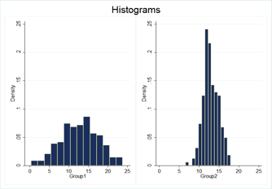

# Introduction

```{r eval=TRUE, echo=F, results="asis"}
BiocStyle::markdown()
library("knitr")
opts_chunk$set(tidy=FALSE,dev="png",fig.show="as.is",
               fig.width=10,fig.height=4,
               message=FALSE,eval=TRUE,warning=FALSE,echo=TRUE)
```

```{r fig.width=2, fig.height=3,echo=FALSE}
library(png)
library(grid)
img <- readPNG("images/fisher.png")
grid.raster(img)
```

> *To consult the statistician after an experiment is finished is often merely to ask him to conduct a post mortem examination. He can perhaps say what the experiment died of.* - R.A. Fisher, 1938

The goals of statistical methods could be summarised as follows

+ drawing conclusions about a population by analysing data on just a sample
+ evaluating the uncertainty in these conclusions; and
+ designing the sampling approach so that valid and accurate conclusions can be made from the data collected

The aim of this course is to get you to ***think about your data*** and select ***which test is appropriate*** for your analysis. We do not aim to teach you new computational skills. Therefore the tasks in this manual, and exercises in the accompanying practical, can be accomponlished using a series of online 'apps' that we have developed.

+ [http://bioinf-rstud001:3838/OneSampleTest/](http://bioinf-rstud001:3838/OneSampleTest/)
+ [http://bioinf-rstud001:3838/TwoSampleTest/](http://bioinf-rstud001:3838/TwoSampleTest/)
+ [http://bioinf-rstud001:3838/contingency-table/](http://bioinf-rstud001:3838/contingency-table/)

The apps were developed using [Shiny](http://shiny.rstudio.com/gallery/), which is an add-on 'package' for the R statistical language that allows analyses to be performed in R without requiring any specialist knowledge. For those that want to progress and learn R, the R code used behind-the-scenes of these apps can be downloaded, modified, or passed-on to collaborators. The Shiny apps are not intended to be a replacement for a statistical software package and only have limited functionality.

However, the techniques and theory you learn should be applicable to any tool for statistical analysis.

The datasets for this manual are included in the [course zip](https://rawgit.com/bioinformatics-core-shared-training/IntroductionToStats/master/CourseData.zip) file. Download and unzip this file, and you will find all the data in the `Manual` folder.

A [**Cheat Sheet**](https://rawgit.com/bioinformatics-core-shared-training/intermediate-stats/master/cheatsheet.pdf) is available that describes the tests that should be used under different circumstances.

# Thinking about your analysis

Statistical tests are used to help us draw conclusions about one or more populations. As populations can be very large, we usually take a sample to collect our data on and perform statistical analyses on this sample data. It is never too early in the research process to start thinking about the statistical methods you will use.


At the design stage of a study, it is invaluable to think about the data that your experiment will generate, how that data might be analysed and what size of effects may be detected. 

We want to generalise our findings from a sample of observations. Most statistical methods rely on the assumption that each observation is sampled independently of the others. In this context, independence means that one observation has no influence over other observations in the sample, or that one observation gives us no information about other observations within the sample. For example:

+ **Suppose you are interested in a measurement taken from each of 20 individuals**. If there is no reason why the measurement for subject 1 should be more related to another measurement in the set of 20 measurements than any other, e.g. no siblings amongst the 20 individuals, only a single measurement from each individual, then in this situation we can say that the 20 measurements are independent of each other.
+ **Suppose you are repeating an experiment six times, each time in triplicate**. The 18 measurements are not independent as observations within an experiment may be more similar than observations from separate experiments. The experimental conditions (e.g. temperatures, reagent preparations, extraction date, etc.) may differ between experiments. We could get six independent mean values by calculating the mean of each triplicate.
+ **Suppose you are measuring blood pressure before and after a treatment for 30 patients**. You will not have 60 independent measurements as we have two sets of measurements per patient. Measurements within a patient may be more similar than between patients. In addition, the treatment may affect the blood pressure measurements taken afterwards. Therefore, measurements before and after treatment are not necessarily comparable. However, for each patient, we can calculate the difference between the measurements before and after treatment. The 30 differences are independent and we might test whether these differences are significant using a t test (more later!).
+ **Suppose you are measuring protein expression in a cell sample which may be one of five cell-types and collected from one of three mice**. As you might be able to tell by now, these 15 samples would not be independent. The protein expression may depend on the cell-type and which of the three mice the sample was collected from. This example is tricky(!) and how you might handle these data will depend on your research question. Advance planning will certainly help.

The type of data you will get will determine which analyses will be most suitable. Data take two main forms; **categorical** or **numerical**.

**Categorical** observations are allocations of individuals to one of two or more classes or categories. These categories may be **nominal** or **ordinal** (some natural ordering of the categories). 

Examples of **nominal** data are: 

+ Sex - Male/female; 
+ Disease status 	– diseased/non-diseased; 
+ Treatment status – treated/non-treated.

Examples of **ordinal** data are: 

+ Smoking – non-smoker/ex-	smoker/light smoker/heavy smoker; 
+ Stage of breast cancer – 	0/1/2/3/4; 
+ socioeconomic status – low/middle/high.

**Numerical** observations may be **discrete** or **continuous**. Discrete numerical variables are often counts of events whereas continuous numerical variables are mostly measurements of some form.

Examples of **discrete** data are: 

+ Number of children; 
+ Sequence tag 	counts (from ChIP-seq); Number of relapses.

Examples of **continuous** data are: 

+ Body Mass Index (BMI); 	
+ Temperature; Blood pressure; Tumour width


# Statistical Analysis

The statistical approach used is dependent on the data type. In this document we will describe **t-tests** (including one-sample, independent two-sample and paired two-sample), which can be used when we have one or two groups of **continuous numerical** data, and **contingency tables** (chi-squared test and Fisher's exact test), which can be used when we have two **categorical** variables (which may be ordinal).

## Exploratory Analysis

Before conducting the formal analysis of our data, it is always a good idea to run some exploratory checks of the data: 

a) To check that the data has been read in or entered correctly; 
b) To identify any outlying values and if there is reason to question their validity, exclude them or investigate them further; 
c) To see the distribution of the observations and whether the planned analyses are appropriate.

## Summary Statistics

Summary statistics give you an initial impression of the data – the most common measures of the location and spread of the data are, respectively, the **mean** and **standard deviation**. The **mean** is the sum of all observations divided by the number of observations.

E.g. No. of facebook friends for 7 colleagues: $311, 345, 270, 310, 243, 5300, 11$

The mean is given by:

$$X = \frac{311+345+270+310+243+5300+11}{7} = 970 $$

The **standard deviation** is the square root of the variance of our observations. The variance is the sum of squared differences between each observation and the mean divided by the number of observations.

$$s.d = \sqrt{\frac{(311-970)^2 + (345 - 970)^2 + \dots (11-970)^2}{7}}=1913$$

**When the data are *skewed*** by several extreme, but valid, observations, the **median** and **interquartile range** may be more meaningful summary measures than the mean and standard deviation. With the extreme observation 5300 in our data-set, the median and interquartile range could provide a more suitable summary of our data. The *median* is the middle observation when the data is ranked in order. When there is an even number of observations, the median is the mean of the two central values.

Therefore, the median of the above data is *310*:

11,243,270, *310*, 311,345,5300

The *interquartile range* is the difference between the upper and lower quartiles (or 75th and 25th centiles). The quartiles are identified in a similar fashion to the median - the middle observations of the lower and upper halves of the data, as *243* and *345*:

11,*243*,270 310, 311,*345*,5300. 

Therefore, the interquartile range is $345-243=\textbf{102}$.


## Outliers, or missing data?

Summary statistics and exploratory plots can help us identify missing and strange values – both of which can have considerable influence on our analyses. Missing values can bias our conclusions unless we can make the assumption that these values are missing completely at random (i.e. independent of observed and unobserved variables). Outlying values should only be excluded if there is reason to question their validity. Therefore, complete and accurate data collection is important.

Let’s suppose that upon further investigation, the **5300** Facebook friends observed was erroneous and should have actually been input as ***530***. We recalculate the mean and standard deviation as: *289* and *154* respectively.

## Standard error of the mean vs. Standard Deviation

The standard deviation is often confused with the standard error of the mean. 



The *standard deviation* quantifies the spread or variability of the observations. In Figure \ref{histograms} can see that the standard deviation of the observations in *Group 1* is **greater** than the standard deviation of the observations in *Group 2*. The *standard error of the mean* quantifies how precisely we know the true mean. The standard error of the mean is the standard deviation divided by the square root of the number of observations. In our example data, the standard error of the mean (s.e.m.) is given by: 

$$ se = \frac{sd}{\sqrt{n}} = \frac{154}{\sqrt{7}} = 58 $$

We can use the **standard error of the mean** to calculate a **confidence interval** for the mean. The **confidence interval** indicates the uncertainty about the estimate. 

The normal distribution plays an important part in confidence interval estimation. Essentially, the frequency distribution of the sample mean is normal, irrespective of the shape of the frequency distribution of the population from which the sample comes. The approximation is better if the population itself is reasonably normal but even if not it gets closer as the sample size increases.

```{r echo=FALSE,fig.show='asis',fig.height=6,fig.width=10,warning=FALSE,message=FALSE}
library(RColorBrewer)
library(ggplot2)
library(gridExtra)
library(grid)
x     = rnorm(10000, 0, 1)
sd <- sd(x)
me <- mean(x)

dat <- data.frame(x=x)
rects <- data.frame(xstart = c(me-2.58,me-1.96,me-1), xend = c(me+2.58,me+1.96,me+1),col=letters[1:3])


normdist <- ggplot() +   geom_histogram(data = dat, aes(x))+  geom_rect(data = rects, aes(xmin = xstart, xmax = xend, ymin = -Inf, ymax = Inf,fill=col),alpha=0.4) + ylab("") + xlab("") + geom_segment(aes(x = me-1, y = 999, xend = me +1, yend=999),arrow=arrow(length=unit(0.5, "cm"), ends="both")) + geom_segment(aes(x = me-1.96, y = 959, xend = me +1.96, yend=959),arrow=arrow(length=unit(0.5, "cm"), ends="both"))  + 
geom_segment(aes(x = me-2.58, y = 919, xend = me +2.58, yend=919),arrow=arrow(length=unit(0.5, "cm"), ends="both")) + theme(legend.position="none") + annotate("text", x=me, y=980,label="67% of data",color="red") + annotate("text", x=me+1, y=750,label="mean + s.e",color="blue") + annotate("text", x=me-1, y=750,label="mean - s.e",color="blue") + annotate("text", x=me, y=940,label="95% of data",color="red") + annotate("text", x=me-1.96, y=550,label="mean - 1.96s.e",color="blue") + annotate("text", x=me+1.96, y=550,label="mean + 1.96 s.e",color="blue") + annotate("text", x=me, y=900,label="99% of data",color="red") + annotate("text", x=me-2.56, y=350,label="mean - 2.56s.e",color="blue") + annotate("text", x=me+2.56, y=350,label="mean + 2.56s.e",color="blue")
            
normdist
```

It is most common to calculate a 95\% confidence interval as:

$$(mean - 1.96 s.e, mean+1.96s.e)$$

If we were to take many random samples, of equal size, from our population of interest, then the mean estimates of all these samples would be normally distributed. Amongst the 95% confidence intervals of those means, we would expect 95% to contain the true population mean. Hence, for our example above (number of Facebook friends of seven colleagues) the 95% confidence interval for mean number of Facebook friends is:

+ Mean 289, 95$\%$ CI ( $289 - (1.96 \times 58),  289 + (1.96 \times 58)$)
+ Mean 289, 95$\%$ CI ( 175,  402)

The confidence interval is quite wide which indicates that we are quite uncertain of the true mean number of Facebook friends of \textbf{all} colleagues.

# Graphs

One of the best ways of displaying data is by using a graph. Graphs can make both simple and complex data easier to understand by making it easier to spot trends and patterns. We can use plots to view the distribution of our data (minimum, maximum, mid-point, spread etc) and to ensure that the values in our dataset seem realistic. Many statistical tests rely on the assumption that the data are normally distributed, which can be assessed using histograms or box plots (more later).

## Scatter Plots
A scatterplot is an excellent way of displaying the relationship between two continuous variables. For example, a scatterplot can be used to show the relationship between age and height. If there is a fairly clear response variable (height in this case) it should be put on the vertical axis with the explanatory variable on the horizontal axis. 

```{r echo=FALSE,fig.show='asis',fig.height=5,fig.width=10,warning=FALSE,message=FALSE}
x <- rnorm(50,10,2)
y <- jitter(15*x + 2,amount=10)
plot(x,y,pch=16,xlab="Age",ylab="Height")
```

Scatter plots are very useful because they show every point in your dataset. You may be able to spot trends in the data and identify any unusual observations (outliers). 


## Boxplots 

A box plot is an excellent way of displaying continuous data when you are interested in the spread of your data. The box of the box plot corresponds to the lower and upper quartiles of the respective observations and the bar within the box, the median. The whiskers of the box plot correspond to the distance between the lower/upper quartile and the *smaller* of: the smaller/largest measurement **OR** 1.5 times the interquartile range. 

A disadvantage of the box plot is that you don't see the exact data points. However, box plots are very useful in large datasets where plotting all of the data may give an unclear picture of the shape of your data.

```{r echo=FALSE,fig.show='asis',fig.height=5,fig.width=10,warning=FALSE,message=FALSE}
ko <- rnorm(50,5,2)
wt <-rnorm(55,8,3)
boxplot(wt,ko,names=c("wt","ko"))
```

# Hypothesis testing - basic setup

There are four key steps in hypothesis testing:

1. Formulate a **null hypothesis**, $H_0$. This is the working hypothesis that we wish to disprove.
2. Under the assumption that the **null hypothesis** is true, calculate a **test statistic** from the data.
3. Determine whether the **test statistic** is more extreme than we would expect under the **null hypothesis**, i.e. look at the **p-value**.
4. Reject or do not reject the **null hypothesis**.

As the name suggests, the null hypothesis typically corresponds to a null effect. 

For example, there is **no difference** in the measurements in group 1 compared with group 2. A small p-value indicates that the probability of observing such a test statistic as small under the assumption that the null hypothesis is true. If the p-value is below a pre-specified **significance level**, then this is a **significant result** and, we would conclude, there is evidence to reject the null hypothesis.

The **significance level** is most commonly set at 5% and may also be thought of as the **false positive rate**. That is, there is a 5% chance that the null hypothesis is true for data-sets with test statistics corresponding to p-values of less than 0.05 – we may wrongly reject the null hypothesis when the null hypothesis is true (false positive).

```{r echo=FALSE,fig.show='asis',fig.height=5,fig.width=10,warning=FALSE,message=FALSE}
x     = rnorm(10000, 0, 1)
sd <- sd(x)
me <- mean(x)

dat <- data.frame(x=x)
rects <- data.frame(xstart = c(-1.96,1.96), xend = c(-Inf,Inf),col=c("A","A"))

normdist <- ggplot() +   geom_histogram(data = dat, aes(x))+  geom_rect(data = rects, aes(xmin = xstart, xmax = xend, ymin = -Inf, ymax = Inf),alpha=0.4,fill="yellow") + ylab("") + xlab("") + theme(legend.position="none")
            
normdist
```

Equally, we may make **false negative** conclusions from statistical tests. In other words, we may not reject the null hypothesis when the null hypothesis is, in fact, not true. When referring to the false negative rate, statisticians usually refer to **power**, which is 1-false negative rate. 

The **power** of a statistical test will depend on:


+ The **significance level** - a 5% test of significance will have a greater chance of rejecting the null than a 1% test because the strength of evidence required for rejection is less.
+ The **sample size** – the larger the sample size, the more accurate our estimates (e.g. of the mean) which means we can differentiate between the null and alternative hypotheses more clearly.
+ The **size of the difference or effect** we wish to detect – bigger differences (i.e. alternative hypotheses) are easier to detect than smaller differences.
+ The **variability**, or standard deviation, of the observations – the more variable our observations, the less accurate our estimates which means it is more difficult to differentiate between the null and alternative hypotheses.

# T-tests 

T-tests can be broken down into two main types: one-sample and two-sample. Both will be discussed below with examples of their applications. The two-sample t-test can also be broken down further into independent and paired t-tests, which will both be discussed below.

## One-Sample t-test
A one-sample t-test is the most basic t-test available and should be used if you want to test whether your population mean may be significantly different to a hypothesised mean. As it is rarely possible to measure the whole population, a sample is taken in the hope that it is representative of the wider population. 

The Shiny app to perform tests of this kind can be found at:- 

[http://bioinf-rstud001:3838/OneSampleTest/](http://bioinf-rstud001:3838/OneSampleTest/)

### Example

A microarray supplier claims that their microarray failure rate is 2.1\%. A lab would like to know whether this reflects the failure rates that they've observed over the last 12-months, so they have collected failure rate data on a monthly basis. The data are given in Table $\ref{microarrayTable}$. The first time we load the [one-sample test Shiny app](http://bioinf-rstud001:3838/OneSampleTest/), these data will be loaded automatically.

Our \textbf{null hypothesis} is that the mean monthly failure rate of the microarrays is \textbf{equal} to 2.1\%. i.e.

+ **Mean monthly failure rate $= 2.1\%$**

Our **alternative hypothesis** is that the mean monthly failure rate of the microarrays is **not equal** to 2.1\%. i.e.

+ **Mean monthly failure rate $\ne 2.1\%$**

```{r echo=FALSE,results="asis",message=FALSE,}
library(xtable)
data<-data.frame(Month=month.name,Failure=c(2.9,2.99,2.48,1.48,2.71,4.17,3.74,3.04,1.23,2.72,3.23,3.4))
print(xtable(data,label = "microarrayTable",caption="Mean monthly microarray failure rate"),row.names=FALSE,comment=FALSE)
```

To calculate the mean for this sample we add up the 12 values of the monthly failure rate and divide this number by the number of observations in the sample, in this case 12. So the sample mean is: (`r paste(data[,2],collapse=" + ")`) / `r nrow(data)` = `r round(mean(data[,2]),3)`.

We can see straight away that the sample mean of `r round(mean(data[,2]),3)` is higher than our hypothesised mean of 2.1, but we cannot yet say if it is ***significantly*** different, that is if the difference is greater than we would expect by chance. This is where the one-sample t-test should be used.

A two-sided test is used when you want to know if the population mean is ***different*** to a hypothesised value. A one-sided test is used when you want to know if the population mean is either ***higher*** or ***lower*** than that hypothesised value and you can justify that observing a difference in one direction would lead to the same action/conclusion as if no difference had been observed. **A two-sided test is always favoured** unless there is a strong argument for a one-sided test. In this example, we have not specified in our hypothesis whether we think the mean monthly failure rate of the microarrays is higher or lower than 2.1\%, so we will use a two-sided t-test.

The one sample t-test is based on the formula:

$$t_{n-1} = \frac{\bar{x} - \mu_0}{s / \sqrt{n}}$$

where;

+ $\bar{x}$ is the sample mean
+ $\mu_0$ is the hypothesised mean
+ $s$ is the sample standard deviation
+ $n$ is the sample size

The key assumptions of the one-sample t-test are;

1. The observations are independent
2. The observations are normally distributed


Before conducting the one sample t-test, we need to check the observations are normally distributed. This is done automatically by the Shiny app, and can be viewed by clicking the ***Data Distribution*** tab. You will need to change the value inside the ***True mean*** box to get the red-dotted line to show the true mean that we wish to compare to (i.e. 2.1 in this case).

```{r echo=FALSE}
df<-data.frame(Month=month.name,Failure=c(2.9,2.99,2.48,1.48,2.71,4.17,3.74,3.04,1.23,2.72,3.23,3.4))
colnames(df)[2] <- "X"


  p<- ggplot(df, aes(x=X)) + 
    geom_histogram(aes(y=..density..),      # Histogram with density instead of count on y-axis
                   binwidth=.5,
                   colour="black", fill="white") + ylab("") 

  p <- p + stat_function(fun=dnorm,
                           color="red",
                           arg=list(mean=mean(df$X), 
                                    sd=sd(df$X)))
  
  P<- p + geom_vline(xintercept=2.1,lty=2,col="red")
  p
```

We want the histogram to be fairly symmetrical with a rough bell shape like that of the plot on the right hand side above. It is often difficult to assess whether data from a small sample are normally distributed, as a single observation can distort the shape of the histogram. 

This histogram is ***fairly symmetrical with a rough bell shape*** (it doesn't have to be perfect!) so the normality assumption seems reasonable. Slight deviations from normality are rarely a problem as the t-test is fairly robust. 


Assuming that the null hypothesis is true, our t-statistic comes from the t distribution with 11 degrees of freedom

$$ t_{n-1} = t_11 = \frac{\bar{x} - \mu_0}{s / \sqrt{n}} = \frac{2.84-2.10}{0.84 / \sqrt{12}} = \frac{0.74}{0.24} = 3.07$$

```{r echo=FALSE,fig.cap="t-distribution with 11 degrees of freedom. The t-statistic 3.07 is indicated"}

mu <- 2.1

degfree <- nrow(df)-1
tstat <- t.test(df$X,mu=mu)$statistic
      
df <- data.frame(ts = rt(10000,df=degfree))
  
      
p<- ggplot(df, aes(x=ts)) + 
  geom_histogram(aes(y=..density..),      # Histogram with density instead of count on y-axis
               binwidth=.5,
               colour="black", fill="white") +
  geom_density()

xlim <- c(min(tstat-0.2,min(df$ts)), max(tstat+0.2, max(df$ts)))

critvals <- c(qt(0.05, degfree),qt(0.95,degfree))
rect1 <- data.frame(xmin = min(critvals[1],xlim),xmax = critvals[1], ymin=-Inf,ymax=Inf)
rect2 <- data.frame(xmin = critvals[2],xmax = max(critvals[2],xlim), ymin=-Inf,ymax=Inf)
      
 p <- p + geom_rect(data=rect1,aes(xmin=xmin, xmax=xmax, ymin=ymin, ymax=ymax),color="grey20", alpha=0.5, inherit.aes = FALSE) + geom_rect(data=rect2,aes(xmin=xmin, xmax=xmax, ymin=ymin, ymax=ymax),color="grey20", alpha=0.5, inherit.aes = FALSE)
 p <- p + geom_vline(xintercept = tstat,lty=2,col="red") + xlim(xlim)
print(p)
```

Under the null hypothesis, that the mean monthly failure rate of the microarrays = 2.1%, we can see that the probability of observing a value of the t-statistic as extreme as 3.07  is very small. This **p-value** is

$$P(T \le 3.07 | T \ge 3.07) = 0.01 $$


As the p-value of 0.01 is less than 0.05 (5%), there is **evidence to reject the null hypothesis** and conclude that there is evidence to suggest that the failure rate of the microarrays from this supplier is not 2.1. 

Clicking the ***Test Result*** tab in [Shiny](http://bioinf-rstud001:3838/OneSampleTest/), will reveal the results of the one-sample test, as performed in R. Make sure that you have set the value in the ***True mean*** box to be the correct value. You should see the same test statistic and p-value being reported.

```{r echo=FALSE}
df<-data.frame(Month=month.name,Failure=c(2.9,2.99,2.48,1.48,2.71,4.17,3.74,3.04,1.23,2.72,3.23,3.4))
res <- t.test(df[,2],mu=2.1)
res
```


## Two-Sample t-test

A two-sample t-test should be used if you want to *compare the measurements of two populations*. There are two types of two-sample t-test: ***independent*** (unpaired) and ***paired*** (dependent).

An independent two-sample t-test is used when the two samples are *independent* of each other, e.g. comparing the mean response of two groups of patients on treatment vs. control in a clinical trial. As the name suggests, a paired two-sample t-test is used when the two samples are paired, e.g. comparing the mean blood pressure of patients before and after treatment (two measurements per patient).

The Shiny app to perform tests of this kind can be found at:- 

[http://bioinf-rstud001:3838/TwoSampleTest/](http://bioinf-rstud001:3838/TwoSampleTest/)


### Independent two-sample t-test


```{r results="asis",echo=FALSE,message=FALSE}

df <- read.csv("Manual/Independent two-sample t-test.csv")
print(xtable(head(df),label = "MiceWeights",caption="Weights of 2 breeds (A and B) of 4 week-old male mice"),comment= FALSE)
```


**Example**: A researcher is interested in the effect of breed on weight in 4 week old male mice.  40 male mice were used, 20 of breed A and 20 of breed B. The first rows of these data are shown in Table $\ref{MiceWeights}$. The first time we load the [two-sample test Shiny app](http://bioinf-rstud001:3838/TwoSampleTest/), these data will be loaded automatically.


So, the researcher wants to test the **null hypothesis** that the mean weight of breed A is ***equal*** to the mean weight of breed A in 4 week-old male mice.

+ *Mean weight of breed A = Mean weight of breed B*

Our **alternative hypothesis** is that the mean weight of breed A is ***not equal*** to the mean weight of breed B in 4 week-old male mice.

+ *Mean weight of breed A $\ne$ Mean weight of breed B*


To perform the independent two-sample t-test, we would calculate the following t-statistic from our data:

$$t_{df} = \frac{\bar{X}_A  - \bar{X}_B}{s.e (\bar{X}_A - \bar{X}_B)}$$

where;


******

+ $\bar{X}_A$ is the mean weight of mice in breed A
+ $\bar{X}_B$ is the mean weight of mice in breed B
+ $s.e(\bar{X_A} - \bar{X}_B)$ is the standard error of the difference in mean weights
+ $df$ is the degrees of freedom and is equal the total number of mice (breed A and breed B) minus the number of independent groups (N -2)

******

However, before we can perform this test, we need to check that the assumptions of the test are met.


The independent two-sample t-test has similar assumptions to the one-sample t-test:

******

+ The observations are **independent**
+ The measurements in each group are **normally distributed**
+ The variances of the measurements in the two groups are **equal**

******

We will come to the third assumption later. To assess the **distribution of the observations** in each of the two groups, we view the  histograms just as we did for the one-sample t-test by clicking the ***Histogram*** and ***Data Distribution*** tabs. Note that this time we get separate boxplots and histograms for each group.

```{r echo=FALSE}
data <- data.frame(variable=c(rep('Breed.A',20),rep('Breed.B',20)),value=c(20.77,9.08,9.8,8.13,16.54,11.36,11.47,12.1,14.04,16.82,6.32,17.51,9.87,12.41,
                                                                                               7.39,9.23,4.06,8.26,10.24,14.64,15.51,12.93,11.5,16.07,15.51,17.66,11.25,13.65,
                                                                                               14.28,13.21,10.28,12.41,9.63,14.75,9.81,13.02,12.33,11.9,8.98,11.29))

 dl <- split(data,data$variable)
  df1 <- dl[[1]]
  df2 <- dl[[2]]
library(ggplot2)
  p1<- ggplot(df1, aes(x=value)) + 
    geom_histogram(aes(y=..density..),      # Histogram with density instead of count on y-axis

                   colour="black",fill="white") + xlim(min(data$value),max(data$value)) + ggtitle(names(dl)[1])
  
  p1 <- p1 + stat_function(fun=dnorm,
                         color="red",
                         arg=list(mean=mean(na.omit(df1$value)), 
                                  sd=sd(na.omit(df1$value))))
  p2<- ggplot(df2, aes(x=value)) + 
    geom_histogram(aes(y=..density..),      # Histogram with density instead of count on y-axis
                   
                   colour="black",fill="white") + xlim(min(data$value),max(data$value)) + ggtitle(names(dl)[2])
  
  p2 <- p2 + stat_function(fun=dnorm,
                           color="red",
                           arg=list(mean=mean(df2$value), 
                                    sd=sd(df2$value)))
  p <- grid.arrange(p1,p2,ncol=2)
```

Here, the histogram for each breed is fairly symmetrical with a rough bell shape. The normality assumption seems reasonable and so we can carry out the independent two-sample t-test. The third assumption of the independent two-sample t-test is that the **data in each of the two groups should have approximately equal variance**. This can be assessed visually by inspecting the boxplots of the data. 

```{r echo=FALSE}
p <- ggplot(data, aes(x = variable,y=value,fill=variable)) + geom_boxplot() + geom_jitter(position = position_jitter(width = .05)) + coord_flip()
p
```

In this example, the variances of the two groups appear to be different. This means that we **cannot assume equal variance** between the two different breeds of mice and so, a slightly different formulation of the two-sample t-test is needed. When selecting the two-sample t-test, a **Welch's correction needs to be applied**. You can do this by un-ticking the ***Equal variances*** tab in the Shiny app.  You may be tempted to apply the Welch's correction routinely, even in cases where the variance is similar in your two groups. However, this is not recommended because the use of the Welch's correction has a large impact on the degrees of freedom of the test. When the variances are similar, an unpaired t-test ***with*** a Welch's correction is much less powerful than a standard unpaired t-test ***without*** the Welch's correction. 

The results of the test, as calculated in R are given in the ***Test Resul*** tab of the Shiny app.

```{r echo=FALSE}
MiceWeight <- read.csv("Manual/Independent two-sample t-test.csv")
res <- t.test(Weight~Breed,data=MiceWeight)
res
```

The mean weight of Breed A male mice at 4 weeks old was `r res$estimate[1]`g, whilst for Breed B the mean weight was `r res$estimate[2]`g. The Welch-corrected t-statistic is given by:


$$t_{29} = \frac{\bar{X}_A - \bar{X}_B}{s.e(\bar{X}_A - \bar{X}_B)} = 1.21$$


We can see that the t-statistic we observe is consistent with the null hypothesis, that the mean weight of 4 week old male mice is the same for breeds A and B. That is, the probability of observing a t-statistic of 1.21 or more, or -1.21 or less, is quite high:

$$P(T \le -1.21 | T \ge 1.21) = 0.24$$

This is not a significant result (p$>0.05$), so there is ***no evidence of a difference*** in the weight of male mice at 4 weeks old between Breeds A and B. 


### Paired two-sample t-test


```{r results="asis",echo=FALSE,message=FALSE}

df <- read.csv("Manual/Paired two-sample t-test.csv")
df$Difference <- df$B - df$A
print(xtable(df,label = "cellularity",caption="Cellularity at two sites of disesase"),comment= FALSE)
```


**Example**: 20 patients with advanced cancer were studied using MRI imaging. Cellularity was measured for each individual patient by estimating water movement. We want to know whether there is a significant difference in the cellularity between two sites in the body; A and B. The data are shown in Table $\ref{cellularity}$. We want to test the **null hypothesis** that the mean cellularity at site A is equal to the mean cellularity at site B. This is like saying:

+ Mean cellularity at site A = mean cellularity at site B

Essentially, this two-sample test corresponds to a formal comparison of the **differences between each pair** of cellularities with 0 (so a one-sample t-test). We could reformulate our null hypothesis as:

+ Mean difference in cellularities at site A and site B =0 

Our **alternative hypothesis** is that the mean cellularity at site A is ***not equal*** to the mean cellularity at site B. This is like saying:

+ Mean cellularity at site A $\ne$ Mean cellularity at site B

To perform the paired two-sample t-test, we calculate the following t-statistic from our data in the following way:

$$ t_{n-1} = t_{19} = \frac{\bar{X}_{A - B}}{s.e.(\bar{X}_{A-B})} $$

where

******

+ $\bar{X}_{A-B}$ is the mean difference in cellularities between the two sites
+ $s.e(\bar{X}_{A-B})$ is the standard error of the mean difference in cellularities

******

The assumptions of the paired t-test coincide with those of the one-sample t-test:

******

+ The observed *differences* are *independent*
+ The observed *differences* are *normally distributed*

******

### Loading the example data into the Shiny app

The data for this example are included in the [course zip](https://rawgit.com/bioinformatics-core-shared-training/IntroductionToStats/master/CourseData.zip) file. Click the ***Choose File*** button in Shiny and navigate to where you unzipped this zip file to. Select the file `Paired two-sample t-test.csv` in the folder `Manual`. The data from this file should be imported. Tick the ***'Paired Test'*** option. 

```{r echo=FALSE,message=FALSE,results='hide'}
myfile <- "Manual/Paired two-sample t-test.csv"
sep <- ','
quote <- '"'
header <-  TRUE 
skip <-  0 
data <- read.csv(myfile, header=header, sep=sep, quote=quote,skip=skip)
data <- reshape2::melt(data)
colnames(data) <- c('variable','value')
library(ggplot2)
p <- ggplot(data, aes(x=value)) + geom_histogram(aes(y=..density..),colour='black',fill='white') + facet_wrap(~variable) + stat_function(fun=dnorm,color='red',arg=list(mean=mean(data$value), sd=sd(data$value)))
newDf <- do.call(cbind,split(data$value,data$variable))
Diff <- data.frame(Difference=newDf[,1] - newDf[,2])
p2 <- ggplot(Diff,aes(x=Difference)) + geom_histogram(aes(y=..density..),colour='black',fill='white') + stat_function(fun=dnorm, color='red', arg=list(mean=mean(Diff$Difference), sd=sd(Diff$Difference)))
p <- gridExtra::grid.arrange(p,p2)
p
```


If satisfied with the normality assumption, we can go ahead with the paired two-sample t-test. The following should be displayed in the ***Test Result*** tab.

```{r echo=FALSE}
paired <- read.csv("Manual/Paired two-sample t-test.csv")
res <- t.test(paired$A,paired$B,paired=TRUE)
res
```

The mean difference in cellularity between the two sites of disease was `r res$estimate`. The corresponding t-statistic is:

$$ t_{n-1} = t_{19} = \frac{\bar{X}_{A-B}}{s.e(\bar{X}_{A-B})}$$

Under the null hypothesis that there is no difference in the cellularities between the two sites of disease, we can see that the probability of observing such a large t-statistic is very small: the p-value is `r round(res$p.value,3)`.
This is a significant result (p $<$ 0.05), so there is ***evidence of a difference*** in the cellularity between Site A and Site B in patients with advanced cancer.

## What to do if the normality assumption is unreasonable?

There may be instances where normality is hard to determine from histograms, for example, where the sample size is small. In these situations, we may need to draw on the experience of similar sets of measurements. Bland and Altman (2009) observed that:-

> *body size measurements are usually approximately normal, as are the logarithms of many blood concentrations and the square roots of counts.*

In other instances, normality may be an unreasonable assumption to make and a t-test is then inappropriate. There are two main options in this circumstance:

+ Transformations
+ Non-parametric tests

Several transformations are possible in Shiny by changing the ***Transformation*** option. The tests we have described all have a *non-parametric* alternative. We now describe these tests in more detail. 

A [**Cheat Sheet**](https://rawgit.com/bioinformatics-core-shared-training/intermediate-stats/master/cheatsheet.pdf) is available that describes the tests that should be used under different circumstances.

# Non-parametric tests

## Mann-Whitney U Rank Sum Test

This test has many different names including the *Wilcoxon*, *Wilcoxon two sample test*, *Wilcoxon-Mann-Whitney*, *Wilcoxon rank sum* and the *Mann-Whitney-U test*.  However, this test should **not** be confused with the Wilcoxon signed rank test.  To avoid confusion this test is usually referred to as the **Mann-Whitney U test**, which is used when the **dependent variable to be examined is continuous** but the assumptions for parametric tests are violated.  


The assumptions of the Mann-Whitney U are as follows:

1. The dependent variable is ordinal or continuous.
2. The data consist of a randomly selected sample of independent observations from two independent groups.
3. The dependent variables for the two independent groups share a similar shape.

If the third assumption holds then the hypotheses are:

+ $H_0$: The medians in the two groups are equal.
+ $H_A$: There is a difference in medians between the two groups.

If the third assumption does not hold:

+ $H_0$: The two groups have the same shape and location.
+ $H_A$: The two groups have a different shape and location.

The alternative hypothesis can be directional, or non-directional.

If the assumptions are met then the Mann-Whitney U test can be carried out as follows:

1. Construct the null and alternative hypotheses and determine the level of significance.
2. Rank the combined sample of observations from smallest to largest.
3. Assign the average of the tied ranks to tied observations.
4. Calculate the sum of the ranks for the two groups separately.
5. Calculate $U_1$ and $U_2$, which are defined as:

$$ U_1 = n_1n_2 + \frac{n_1(n_1+1)}{2} - R_1 $$

$$ U_2 = n_1n_2 + \frac{n_2(n_2+1)}{2} - R_2 $$

where

+ $n_1$ = the number of observations in group 1
+ $n_2$ = the number of observations in group 2
+ $R_1$ = the sum of the ranks assigned to group 1
+ $R_2$ = the sum of the ranks assigned to group 2

6. Calculate $U = min (U_1, U_2)$.
7. Compare $U$ with the critical value of $U$ at the predetermined level of significance.
8. The null hypothesis is rejected if $U$ is smaller than the critical value in the table.

When the sample size is large, the distribution of U quickly tends to a normal distribution, with mean

$$ u = \frac{n_1n_2}{2} $$

and standard deviation

$$ \sigma_u = \sqrt{\frac{n_1n_2(n_1+n_2+1)}{12}} $$

In this case, a $z$ statistic is calculated rather than the $U$ statistic. The $z$ statistic is

$$ z = \frac{U - \mu_u}{\sigma_u} = \frac{U - \frac{n_1n_2}{2]}}{\sqrt{\frac{n_1n_2(n_1+n_2+1)}{12}}} $$ 

### Example

The data are a small subset of the data from Coronary Artery Surgery Study (Data from Fisher’s book) and consist of time on a treadmill (seconds) for a control group and a group with three vessels disease.  

```{r eval=FALSE,echo=FALSE}

Control <- c(1014,684,810,990,840,978,1002,1110)
ThreeVessels <- c(864,636,638,708,786,600,1320,750,594,750)
data <- data.frame(Group = c(rep("Control",length(Control)),rep("ThreeVessels",length(ThreeVessels))), Time = c(Control,ThreeVessels))
write.csv(data,"Manual/treadmill-times.csv",row.names=FALSE,quote=FALSE)
```

```{r echo=FALSE}
library(knitr)
data <- read.csv("Manual/treadmill-times.csv")
kable(data)
```

+ $H_0$: There is no difference in exercise times for the two groups.
+ $H_A$: There is a difference in the exercise time for the two groups.

The first step is to calculate ranks for the complete set of observations:-

```{r echo=FALSE}
data$Rank <- rank(data$Time)
kable(data)
```

The sum of the ranks for the control group is 101, and the sum of the ranks for the three vessels disease group is 70.

$$ U_1 = 8 \times 10 + \frac{8 (8+1)}{2} - 101 = 15 $$

$$ U_2 = 8 \times 10 + \frac{10 (10+1)}{2} - 70 = 65 $$

As 15 < 17, [the value from the tables], there is sufficient evidence to reject the null hypothesis at the 5% level of significance.  Therefore, the control group would exercise longer than those with three vessels disease would, $p=0.025$.

### Analysis using Shiny

These data can be found in the file `treadmill-times.csv` in the `Manual` folder. We can upload the file using the ***Browse*** button. Make sure that ***1st column is a factor?*** is selected; The data should be visible in the tab ***The data***. You can view the data distributions using the ***Data Distribution*** and ***Histogram*** tabs. 

To perform the test itself, make sure that ***Use Parametric Test*** and ***Paired Test*** are not ticked. The following should appear in the tab ***Test Result***;

```{r echo=FALSE}
wilcox.test(Time~Group,data,correct=FALSE)
```

***You should notice that R seems to report a different statistic to the manual calculations we used. Specifically it is reporting $max(U_1,U_2)$. However, the same p-value is arrived at in both cases***.

## Wilcoxon Signed-Rank Test

### When to use

The Wilcoxon Signed Rank Test tests the assumption that the sum of the positive ranks equals the sum of the negative ranks.  The test statistic is the smaller of the sum of the positive and the sum of the negative ranks.  The data should be continuous or ordinal in nature.  The paired differences should be independent and symmetrical about the true median difference. 

### Method

+ Find the difference in values for each pair (variable 1 – variable 2).  
+ Rank the magnitude of the differences, smallest to largest, assigning the average rank to ties in the differences and no rank to zero differences.
+ Find the sum of the ranks for the positive differences, $W^+$ and the sum of the ranks for the negative differences, $W^-$.  
+ Find N, the total number of differences not including ties.  
+ Find the critical value from the tables and compare $W=min (W^+, W^-)$ reject the null hypothesis if $W$ is less than or equal to the critical value.  
+ If $W^+>W^-$, then variable one tends to be greater than variable two and vice versa.

### Example

As part of a study Mcm2 and Ki67 values were compared to see if there was a difference between the values in patients with cancer.  Data are shown in the table below.  A plot of the differences shows that they are plausibly symmetric so the assumption of symmetry holds.

```{r eval=FALSE,echo=FALSE}

data <- data.frame(Mcm2 = c(14.78,7.96,10.89,12.10,18.23,16.40,18.02,23.35,26.70),Ki67 = c(14.78,8.68,1.57,1.85,5.84,3.04,3.96,8.16,8.40))
write.csv(data,"Manual/wilcox-srt.csv",quote=FALSE,row.names=FALSE)
```

```{r results='asis',echo=FALSE}
data <- read.csv("Manual/wilcox-srt.csv")
data$Difference <- data$Mcm2 - data$Ki67
nz <- data$Difference != 0
data$Rank.Of.Difference[nz] <- rank(data$Difference[nz])
print(xtable(data),comment=FALSE)
```

$W^+=35$, $W^-=1$.  $W=min(W^+, W^-)=1$, $N=8$.  From the tables $(N=8, \alpha=0.05)$ the critical value is 3.  As 1<3, there is sufficient evidence to reject the null hypothesis.  Therefore there is a difference between Mcm2 and Ki67 values.  Mcm2 values tend to be higher than Ki67 values.

### Analysis in Shiny

These data can be found in the file `wilcox-srt.csv` and can be imported into the Shiny app using the ***Browse*** button. Make sure that the ***1st column is a factor*** button is **not** ticked, and the data should appear in the ***The data*** tab. Are these data are paired, you will need to tick the ***Paired Test*** tickbox. The ***Test Result*** tab should then display the following result:-


```{r echo=FALSE,warning=FALSE}
data <- read.csv("Manual/wilcox-srt.csv")
wilcox.test(data$Mcm2,data$Ki67,paired=TRUE)
```

## Sign Test

This is one of the oldest non-parametric tests.  It is so named because it uses the sign of the differences between two measurements rather than quantitative measurements.  Therefore, it is usually used when quantitative measurement is not possible but it is possible to say which of the pair of observations is greater in some sense.  It is used in the case of two related samples when it is required to establish that two conditions are different.  It can also be used in the one sample case to decide if the median value is different to the proposed median value.

The hypotheses for the one-sample case are:

There is no difference between the median of a group and a proposed median, m.  

$H_0$: median = m.

The alternative hypothesis can be directional or non-directional.  

$H_A$: median $\ne$ m.

The hypotheses for the two-sample case are:
There is no difference in medians between the two groups. 

$$H_0:  P[X_i > Y_i]= P[X_i < Y_i] = 0.5 $$

The alternative hypothesis can be directional or non-directional.  

$$H_A:  P[X_i > Y_i] \ne P[X_i < Y_i] \ne 0.5 $$


The test can be used provided the following assumptions are met:

1. The data must be dichotomous or continuous and order must be implied by the coding system. 
2. Data are randomly selected and are paired observations from a single sample.  The data may be matched pairs or using the subject as their own control.

Once the assumptions have been met the test can be carried out in the following way:


1. Decide on the null and alternative hypothesis and $\alpha$
2. *One sample*: Determine the sign of the difference between the value and the proposed median. 
*Two sample*: Determine the sign of the difference between the two members of each pair.
3. One sample: Calculate $N$, the number that are different from the median value (ignore ties).
Two sample: Calculate $N$, the number of pairs whose differences show a sign (ignore ties).
4. Let $x$ = the number of fewer signs.  
5. Decide if $x$ is in the critical region of binomial N,0.5.  The null hypothesis is rejected if the probability of obtaining such an extreme occurrence is less than the pre-specified $\alpha$.

When the sample size is large, the normal approximation to the binomial distribution can be used for the sign test.  This distribution has mean $\mu_x$ which equals $np$ and variance $\sigma^2_x$, which equals $npq$.  The value of the $z$ statistic with a continuity correction for categorical data and $p = q = 0.5$ is 

$$ z = \frac{x - \mu}{\sigma_x} = \frac{(x \pm 0.5)-np}{\sqrt{npq}} = \frac{(x \pm 0.5)-0.5n}{0.5\sqrt{n}} $$

where

+ $x=$ the number of +'s or -'s
+ $n=$ the number of paired observations that have been assigned a “+” or “–” value.

When calculating the z statistic, $(x + 0.5)$ is used when $x<0.5n$ and $(x-0.5)$ is used when $x> 0.5n$. The value of $z$ is then compared to the critical value of the standard normal distribution at the pre-stated alpha level ($1.96$ for $\alpha=0.05$).

### Example: One sample case

As part of a study the general health section of the SF-36 was collected.  The subject’s values (shown in the table below) are to be compared to the expected value of 72 within the population using the sign test.

```{r eval=FALSE,echo=FALSE}
data <- data.frame(GH =c(60,55,75,100,55,60,50,60,72,40,90,75,70,75,55))
write.csv(data,"Manual/general-health.csv",quote=FALSE,row.names = FALSE)
```

```{r,echo=FALSE}
library(knitr)
data <- read.csv("Manual/general-health.csv")
kable(data.frame(ID=1:nrow(data),data))
```


1. $H_0$: The General Health values are not different to 72; $H_A$: The General Health values are different to 72.

2.

```{r echo=FALSE,results='asis'}
data <- read.csv("Manual/general-health.csv")
data$Sign <- "="
data$Sign[data$GH > 72] <- "+"
data$Sign[data$GH < 72] <- "-"
kable(data)
```

3. There is one tie so there are 14 values different from the median and N = 14.
4. There are 9 –’s and 5 +’s, therefore x = 5.
5. Looking up N=14, p=0.5, x =5 in binomial tables gives a one-sided p-value (Pr) of 0.212 so the two-sided p-value is 0.42 so there is not sufficient evidence to reject null hypothesis.  Therefore, the General Health values in this population cannot be shown to be different to those in the general population.

The data for this example are in the file `general-health.csv`. Make sure that ***Column containing data to test*** is set to 1 and ***True mean*** is set to 72. De-selecting the ***Use Parametric Test?*** option performs the test.

```{r echo=FALSE}
data <- read.csv("Manual/general-health.csv")
X <- data[,1]
mu <- 72
df <- data.frame(X)
df$Sign <- "="
df$Sign[X > mu] <- "+"
df$Sign[X < mu] <- "-"

npos <- sum(X>mu)
nneg <- sum(X<mu)
x <- min(npos,nneg)
n <- sum(X != mu)
cat(paste("Number of +'s", npos,"\n"))
cat(paste("Number of -'s", nneg,"\n"))
cat(paste("Test statistic:", x,"\n"))
pv <- round(pbinom(q = x, size = n,prob = 0.5)*2,3)
cat(paste("P-value using binomial distribution with",n, "trials and p=0.5:",pv,"\n"))
```


### Example: Two sample case

```{r eval=FALSE,echo=FALSE}

data <- data.frame(Time1 = c(60,55,75,100,55,60,50,60,72,40,90,75,70,75,55),Time2 = c(70,65,100,50,70,95,95,65,85,55,95,45,75,65,60))
write.csv(data,file="Manual/general-health2.csv",quote=FALSE,row.names=FALSE)
```

General health scores were collected on this group of subjects at a second time point; the scores at this time point are shown in the table below.


```{r echo=FALSE,results='asis'}

data <- read.csv("Manual/general-health2.csv")
kable(data)
```

1. $H_0$: The General Health values are the same at both time points
$H_A$: The General Health values are not the same at both time points

2. 

```{r echo=FALSE,results='asis'}
data$Sign <- "="
data$Sign[data$Time1 > data$Time2] <- "+"
data$Sign[data$Time1 < data$Time2] <- "-"
kable(data)
```

3. There are no ties; therefore, there are 15 values that are different to each other, N=15.
4. There are 12 –’s and 3 +’s therefore there are fewer +’s and x = 3.
5. Looking up N=15, p=0.5, x =3 in binomial tables gives a one-sided p-value (Pr) of 0.0176 so the two-sided p-value is 0.035 so there is sufficient evidence to reject null hypothesis.  Therefore, the General Health values are significantly higher at the second time point compared to the first.

The data for this example are in the file `general-health2.csv`. Make sure that ***1st column is a factor*** and ***Use Parametric Test?*** are not ticked. 

When the ***Paired Test*** option is checked, the display in ***The data*** should change to display the differences between the paired observations and the sign (+ or -). You can use this to judge whether the differences are *symmetrical* or not. In this case, we would want to un-check the ***Symmetrical Differences*** option under ***Relationships between groups***. The sign-test that we have just described will then be performed. 

```{r, echo=FALSE}

npos <- sum(data$Sign == "+")
nneg <- sum(data$Sign == "-")
x <- min(npos,nneg)
n <- npos + nneg
cat(paste("Number of +'s", npos,"\n"))
cat(paste("Number of -'s", nneg,"\n"))
cat(paste("Test statistic:", x,"\n"))
pv <- round(pbinom(q = x, size = n,prob = 0.5)*2,3)
cat(paste("P-value using binomial distribution with",n, "trials and p=0.5:",pv,"\n"))
```


The main advantage of the sign test is the lack of assumptions, it is versatile, simple and very easy to use.  It can also be used to test for trend in a series of ordinal measurements or as a quick assessment of direction in an exploratory study.  It does not take into account the magnitude of the differences therefore can be less powerful than the Wilcoxon signed ranks test.

# Tests for categorical variables

When working with categorical variables, we are usually interested in the **frequencies of the different categories** in our sample. To display data for two or more categorical variables, cross-tabulations, or contingency tables, are commonly used - with 2 x 2 tables being the simplest. We can then test whether there is an **association between the row factor and the column factor** by a chi-squared test or a Fisher’s exact test. Table $\ref{CTableExample}$ shows an example of a contingency table.

```{r results="asis",echo=FALSE,message=FALSE}
library(xtable)
df <- data.frame(C1 = c("a","c","a+c"),C2=c("b","d","c+d"),Total = c("a+b","c+d","n=a+b+c+d"), row.names = c("R1","R2","Total"))
print(xtable(df,label = "CTableExample",caption="Example of a contingency table"),comment= FALSE)
```

These tests do not give a measure of effect size; they only give a p-value suggesting whether or not an association exists between the two variables.

The Shiny app to perform tests of this kind can be found at:- 

[http://bioinf-rstud001:3838/contingency-table/](http://bioinf-rstud001:3838/contingency-table/)

## Chi-squared tests

**Example:** A trial was conducted to assess the effectiveness of a new **treatment** versus a **placebo** in reducing tumour size in patients with ovarian cancer. We want to know whether or not there is an association between treatment group and the **incidence of tumour shrinkage**. 


+ The **null hypothesis** is that there is **no association** between treatment group and tumour shrinkage. 

+ The **alternative hypothesis** is that there is **some association** between treatment group and tumour shrinkage.

```{r results="asis",echo=FALSE,message=FALSE}
ctable <- data.frame(Treatment.Group = c("Treatment","Placebo","Total"), TumourShrinkage.No = c(44,24,68), TumourShrinkage.Yes = c(40,16,56),Total=c(84,40,124))
print(xtable(ctable,label = "chiSqObserved",caption="Observed frequencies for chi-squared test"),comment= FALSE)
```


The data in Table $\ref{chiSqObserved}$ can be used to calculate the chi-squared statistic.  These data are automatically loaded when the [contingency-table Shiny app](http://bioinf-rstud001:3838/contingency-table/) is loaded for the first time.

From Table $\ref{chiSqObserved}$ the expected frequencies can be calculated and are shown in Table \ref{chiSqExpected}. The expected frequency for the entry in row $i$ and column $j$ is given by:

$$ row_i \,total \times \frac{column_j\, total }{overall\, total} $$

```{r results="asis",echo=FALSE,message=FALSE}
ctable <- data.frame(Treatment.Group = c("Treatment","Placebo","Total"), TumourShrinkage.Yes = c(46.06,21.94,68), TumourShrinkage.No = c(37.94,18.06,56),Total=c(84,40,124))
print(xtable(ctable,label = "chiSqExpected",caption="Expected frequencies for chi-squared test"),comment= FALSE)
```

As you can see, the observed and expected frequencies are very similar.The chi-squared test statistic is calculated using the following formula:

$$\chi^2_{rows-1,columns-1} = \sum\limits_i\sum\limits_j \frac{(O_{ij}-E_{ij})^2}{E_{ij}}$$

where;

******

+ $O_{ij}$ is the observed frequency for a single cell in row $i$ and column $j$
+ $E_{ij}$ is the expected frequency for the same entry in row $i$ and column $j$
+ $rows$ is the number of rows; $columns$ is the number of columns

******

In the example dataset;

$$\chi^2_1 = \frac{(44-46.06)^2}{46.06} + \frac{(40-37.94)^2}{37.94} + \frac{(24-21.94)^2}{21.94} + \frac{(16-18.06)^2}{18.06} = 0.63$$
Looking at the relevant chi-squared distribution, with one degree of freedom we can see that the chi-squared statistic that we observe is **consistent with the null hypothesis** that there is no association between tumour shrinkage and treatment group.

Under the null hypothesis, the probability of observing a chi-squared statistic of 0.63 is 
$$P(\chi^2_1 \ge 0.63) = 0.43 > 0.05$$


This is not significant at the 5\% level ($p>0.05$). Hence, there is no evidence of an association between treatment group and tumour shrinkage. These values are automatically-calculated for a contingency table by selecting ***Test Result*** in the [contingency-table Shiny app](http://bioinf-rstud001:3838/contingency-table/).

```{r echo=FALSE}
.Table <- matrix(c(44,40,24,16), 2, 2, byrow=TRUE)
.Test <- chisq.test(.Table, correct=FALSE)
.Test$expected
.Test
```


The **chi-squared** test is most suited to large datasets. As a general rule, the chi-squared test is appropriate if **at least 80\% of the cells have an expected frequency of 5 or greater**. In addition, none of the cells should have an expected frequency less than 1. If the expected values are very small, categories may be combined (if it makes sense to do so) to create fewer larger categories. Alternatively, Fisher’s exact test can be used.

## Fisher's Exact test 

Fisher's exact test can be used in exactly the same way as the Chi-squared test. 

**Example**: Suppose that we use the same example as for the Chi-squared test, but this time we have a **smaller sample size** – this time as shown in Table $\ref{fishersObserved}$

```{r results="asis",echo=FALSE,message=FALSE}
ctable <- data.frame(Treatment.Group = c("Treatment","Placebo","Total"), TumourShrinkage.No = c(8,9,17), TumourShrinkage.Yes = c(3,4,7),Total=c(11,13,24))
print(xtable(ctable,label = "fishersObserved",caption="Expected frequencies for chi-squared test"),comment= FALSE)
```

You can enter these data into the Shiny app, by modifying the text in the ***Enter your data as a table*** box. Columns need to be separated by a '-' character, and rows by a '|'. You can check that you have entered the data correctly by looking at ***The data*** tab. You do not need to calculate row or column totals.

The null and alternative hypotheses are identical to those of the Chi-squared test above.

+ The **null hypothesis** is that there is **no association** between treatment group and tumour shrinkage. 

+ The **alternative hypothesis** is that there is **some association** between treatment group and tumour shrinkage. 

In the same way as for the Chi-squared analysis, the expected frequencies can be calculated. These are given in Table $\ref{fishersExpected}$. Notice that \textbf{two of the expected frequencies are less than 5}. As we said earlier if at least 80\% of the cells have an expected frequency of 5 or greater, then the Chi-squared test is not appropriate. Instead, a Fisher's exact test can be used.

```{r results="asis",echo=FALSE,message=FALSE}
ctable <- data.frame(Treatment.Group = c("Treatment","Placebo","Total"), TumourShrinkage.No = c(7.79,9.21,17), TumourShrinkage.Yes = c(3.21,3.79,7),Total=c(11,13,24))
print(xtable(ctable,label = "fishersExpected",caption="Observed frequencies for chi-squared test"),comment= FALSE)
```


On the ***Test Result*** tab, we see the expected frequencies for these data


```{r echo=FALSE}
.Table <- matrix(c(8,3,9,4), 2, 2, byrow=TRUE)
.Test <- chisq.test(.Table, correct=FALSE)
.Test$expected # Expected Counts

```

where we can easily spot the warning regarding low expected frequencies. Therefore, we decide to do a Fisher’s test instead, by selecting the *"Fishers"* option in ***Type of Test***

```{r echo=FALSE}
fisher.test(.Table)
```

The output **Fisher's exact test** tells us that the probability of observing such an extreme combination of frequencies is high, our p-value is 1.000 which is clearly greater than 0.05. 

In this case, there is ***no evidence of an association*** between treatment group and tumour shrinkage.

# Using the Shiny apps

The three apps; 

+ [http://bioinf-rstud001:3838/OneSampleTest/](http://bioinf-rstud001:3838/OneSampleTest/)
+ [http://bioinf-rstud001:3838/TwoSampleTest/](http://bioinf-rstud001:3838/TwoSampleTest/)
+ [http://bioinf-rstud001:3838/contingency-table/](http://bioinf-rstud001:3838/contingency-table/)

have been designed to answer to most-common statistical tests and produce diagnostic plots and summaries of data. The statistical test to be performed can be tailored (e.g. parameteric vs non-parametric) using the options under ***Analysis Parameters***.

You should be able to analyse your own data using these apps; provided the data are in a compatible format. 

## Importing data

The apps come pre-loaded with datasets from this manual, so that you can start playing with the data immediately. It is also possible to analyse your own datasets, provided they are presented in a fairly simple format. Each of the datasets used in this manual, and in the practical, can be found inside the [***CourseData zip file***](https://rawgit.com/bioinformatics-core-shared-training/IntroductionToStats/master/CourseData.zip). Each dataset can be loaded into a spreadsheet or text editor so that you check the format of the data, and try to make your own data match the same format.

Ideally, the file should be in *comma-separated* format. *tab-delimited* files can also be imported by changing the ***Separator*** checkbox to ***Tab***. 

There are also options to include the columns headings from the file (***Header***) or to skip rows in the file (***Number of rows to skip in data file before reading the data***). 

### One-Sample test

Data should be in tabular format, with the data you want to test found in one of the columns of the file. The ***Column containing data to test*** text box can be used to indicate the number of the column containing data. If the wrong column number is selected, error messages will occur.

e.g. for the example "Microarray Failure" dataset the failure rates are found in column 2. It is these values that are used in the histograms, boxplots and statistical tests. 


### Two-Sample test

Two formats are acceptable

1. A file with two columns; each column with the same number of rows. These are the two groups that you want to compare. 
  
    + e.g. `Paired two-sample t-test.csv` in the `Manual` folder
    + e.g. `bloodplasmacancer2.csv` in the `Practical` folder
    
    
2. A file with two columns; the first column indicating the group that each observation belongs to, and the second column being the observation itself. If choosing this format, the ***1st column is a factor?*** box needs to be ticked.

    + e.g. `Independent two-sample t-tes.csv` in the `Manual` folder
    + e.g. `bp_times.csv` in the `Practical` folder
    

## Saving your work


