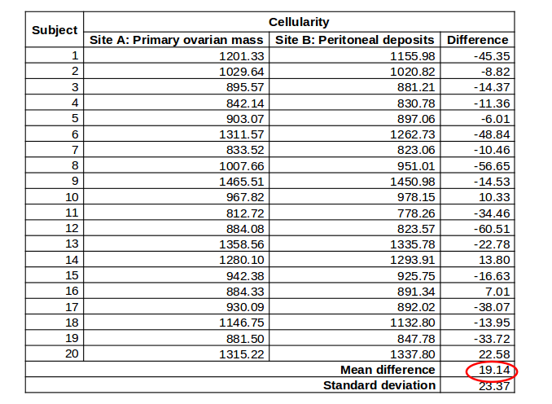

```{r setup, include=FALSE}
knitr::opts_chunk$set(comment = NA,echo=FALSE,message=FALSE,warning = FALSE)
```


# Tests for continuous variables: T-tests

## Statistical tests - continuous variables

- t-test:
    + ***One-sample t-test***
        + (e.g. $H_0$: mean=5)
    + ***Independent two-sample t-test***
        + (e.g. $H_0$: mean of group A = group B)
    + ***Paired two-sample t-test***
        + (e.g. $H_0$: mean difference between pairs = 0)
        + (e.g. before and after treatment)
        
## T-distributions

- We will be computing a test statistic and comparing to a t-distribution with a particular shape
    + the shape of the curve depends on the "degrees of freedom" (number of observations - 1)
    + as n increases, the curve becomes more like the normal distribution
    + the [central limit theorem](https://en.wikipedia.org/wiki/Central_limit_theorem) for those curious enough
    + whereabouts the statistic lies on the curve will give the "p-value"
    + the total area under the curve adds up to 1.
    
```{r warning=FALSE,message=FALSE,echo=FALSE}
library(ggplot2)
library(gridExtra)
ggplot(data.frame(x=c(-4,4)),aes(x,color="red")) + stat_function(fun=dt, args=list(df=1),aes(colour="df=1")) + 
  stat_function(fun=dt, args=list(df=3),aes(colour="df=3")) +
  stat_function(fun=dt, args=list(df=8),aes(colour="df=8")) +
  stat_function(fun=dt, args=list(df=30),aes(colour="df=30")) +
  stat_function(fun=dnorm, aes(colour="normal")) + 
  scale_color_manual(name="Distribution", values=c("red","blue","green","yellow","black")) +
  ggtitle("Comparison of t Distributions") + xlab("") + ylab("")
  
```


## One-sample t-test: does mean = X?

- The Genomics Core is suspicious that their microarrays are failing quite a lot
- Published data suggests that the microarray failure rate for a particular supplier is 2.1%. 
- **Genomics Core want to know if this holds true in their own lab?**
- This test can be performed online using our "shiny" app:-
    + http://bioinformatics.cruk.cam.ac.uk/stats/OneSampleTest/
    + you'll see these data upon loading the site

## One-sample t-test: does mean = X?

- Null hypothesis, $H_0$:
    + Mean monthly failure rate = 2.1%
- Alternative hypothesis: $H_1$:
    + Mean monthly failure rate $\ne$ 2.1%
- Tails: *two-tailed*
    + we are looking at either or an increase or decrease from 2.1
- Either *reject* or *do not reject* the null hypothesis - ***Never accept the alternative hypothesis***

## One sample t-test; the data

- See the ***Data Input*** tab on the shiny app

```{r results='as.is'}
library(ascii)

failure <- data.frame(Month = month.name, "Monthly failure rate" = c(2.9,2.99,2.48,1.48,2.71,4.17,3.74,3.04,1.23,2.72,3.23,3.4))

print(ascii(failure),type="rest")
me <- round(mean(failure$Monthly.failure.rate),3)
sd <- round(sd(failure$Monthly.failure.rate),3)
```


## One-sample t-test; key assumptions

- Observations are independent
    + unless we have good reason to suspect otherwise, we usually assume this
- Observations are normally distributed
    + check the graphs...
    + ***Data Distribution*** tab
    + numerical summaries available here too
    
```{r}
df <- failure
df$X <- df$Monthly.failure.rate
df$tmp <- "x"

brx <- pretty(range(df$X), 
                    n = nclass.Sturges(df$X),min.n = 1)
      
      p2 <- ggplot(df, aes(x=X)) + geom_histogram(breaks=brx,colour="black", fill=rgb(29,0,150,maxColorValue=255)) + ylab("")
p1 <- ggplot(df, aes(x=tmp,y=X)) + xlab("") + geom_violin(fill=rgb(236,0,140,maxColorValue = 255),alpha=0.5) + geom_boxplot(fill="white",width=0.1) + geom_jitter(position = position_jitter(width = .05)) + coord_flip()
grid.arrange(p1,p2)
```

## One-sample t-test; results
mean = $(2.9 + \dots + 3.40) / 12$ = `r me`

Standard deviation = `r sd`

Hypothesised Mean = 2.1

n = `r nrow(failure)`

```{r}
test <- t.test(failure$Monthly.failure.rate,mu=2.1)
stat <- round(test$statistic,3)
pval <- round(test$p.value,3)
degfree <- test$parameter
critvals <- c(qt(0.025, degfree),qt(0.975,degfree))
rect1 <- data.frame(xmin = -4,xmax = critvals[1], ymin=-Inf,ymax=Inf)
rect2 <- data.frame(xmin = critvals[2],xmax = 4, ymin=-Inf,ymax=Inf)
n <- nrow(failure)      
```

Test statistic: $$t_{n-1} = t_{11} = \frac{\bar{x} - \mu_0} {s.d. / \sqrt{n}} = \frac{2.84 - 2.10}{s.e.(\bar{x})}$$

## One-sample t-test; results

Test statistic:= `r stat`

- We need to compare to the t distribution with `r n-1` degrees of freedom
- Having decided a p-value cut-off of 0.05, we can know which values on the x-axis will give an area of 0.05
    + shown in yellow
    + two symmetrical areas as we're doing a *two-tailed* test
- See ***Statistical Analysis*** tab

```{r}
ggplot(data.frame(x=c(-4,4)),aes(x)) + stat_function(fun=dt, args=list(df=11)) +
geom_rect(data=rect1,aes(xmin=xmin, xmax=xmax, ymin=ymin, ymax=ymax),fill="yellow", alpha=0.5, inherit.aes = FALSE) + geom_rect(data=rect2,aes(xmin=xmin, xmax=xmax, ymin=ymin, ymax=ymax),fill="yellow", alpha=0.5, inherit.aes = FALSE)
```

## One-sample t-test; results

```{r}
ggplot(data.frame(x=c(-4,4)),aes(x)) + stat_function(fun=dt, args=list(df=11)) +
geom_rect(data=rect1,aes(xmin=xmin, xmax=xmax, ymin=ymin, ymax=ymax),fill="yellow", alpha=0.5, inherit.aes = FALSE) + geom_rect(data=rect2,aes(xmin=xmin, xmax=xmax, ymin=ymin, ymax=ymax),fill="yellow", alpha=0.5, inherit.aes = FALSE) + geom_vline(xintercept = stat,lty=2,col="red")


```

## One-sample t-test; results

Conclusion: ***Reject*** $H_0$

- There is ***evidence*** that mean monthly failure rate $\ne$ 2.1%
- The mean monthly failure rate of microarrays in the Genomics core is 2.84 (95% CI: 2.30, 3.37).
- It is not equal to the hypothesized mean proposed by the company of 2.1.
- t=3.07, df=11, p=0.01


## One-sample t-test; Exercise

- Work through Exercise 1 of the practical; The effect of disease on height

## Two-sample t-test

- Two types of two-sample t-test:
- Independent:
    + e.g.the weight of two different breeds of mice
    + males versus females, smokers versus non-smokers
- Paired
    + e.g. a measurement of disease at two different parts of the body in the same patient / animal
    + e.g. measurements before and after treatment for the same individual
    + e.g. twins; one twin had a treatment and the other did not
    + e.g. individuals matched for age, sex, tumour grade etc
    
## Independent two-sample t-test: Does the mean of group A = mean of group B?


- e.g. research question: 40 male mice (20 of breed A and 20 of breed B) were weighed at 4 weeks old
- Does the weight of 4-week old male mice depend on breed?

## Independent two-sample t-test: Does the mean of group A = mean of group B?

- Null hypothesis, $H_0$
    + mean weight of breed A = mean weight of breed B
- Alternative hypothesis, $H_1$
    + mean weight of breed B $\ne$ mean weight of breed B
- Tails: two-tailed 
    + the tails on the distribution - not on the mice ;)
- Either ***reject*** or ***do not reject*** the null hypothesis - ***never accept the alternative hypothesis***

## Independent two-sample t-test: the data


You can see these data in shiny

- http://bioinformatics.cruk.cam.ac.uk/stats/TwoSampleTest/


## Independent two-sample t-test: key assumptions

- Observations are independent
- Observations are normally-distributed

```{r results='hide'}
mice <- read.csv("Manual/Independent two-sample t-test.csv")
df <- mice
df$variable <- df$Breed
df$value <- df$Weight
dl <- split(df,df$variable)
df1 <- dl[[1]]
df2 <- dl[[2]]

brx <- pretty(range(df1$value), 
n = nclass.Sturges(df1$value),min.n = 1)

p1 <- ggplot(df1, aes(x=value)) + geom_histogram(breaks=brx,colour="black", fill=rgb(29,0,150,maxColorValue=255),alpha=0.5) + ylab("") 
brx <- pretty(range(df2$value), 
              n = nclass.Sturges(df2$value),min.n = 1)

p2 <- ggplot(df2, aes(x=value)) + geom_histogram(breaks=brx,colour="black", fill=rgb(236,0,140,maxColorValue=255),alpha=0.5) + ylab("") 
p <- grid.arrange(p1,p2,ncol=2)
p

```

## Independent two-sample t-test: further considerations

- We have to check for "equal" variance in the two comparison groups
    + having different variances doesn't mean we can't do the test
    + Use "Welch's correction" if variances are different
    + alters the t-statistic and degrees of freedom
    + there are statistical tests to test for equal variance, but safer to eye-ball the data
    
```{r}
p <- ggplot(df, aes(x = variable,y=value,fill=variable)) + geom_violin(alpha=0.5) + geom_boxplot(fill="white",width=0.1) + geom_jitter(position = position_jitter(width = .05)) + coord_flip() + scale_fill_manual(values=c(rgb(29,0,150,maxColorValue=255), rgb(236,0,140,maxColorValue=255)))
p
test <- t.test(Weight~Breed,data=mice,var.equal = FALSE)
tsat <-round(test$statistic,2)
degfree <- round(test$parameter,2)
pval <- round(test$p.value,2)
critvals <- c(qt(0.025, degfree),qt(0.975,degfree))
rect1 <- data.frame(xmin = -4,xmax = critvals[1], ymin=-Inf,ymax=Inf)
rect2 <- data.frame(xmin = critvals[2],xmax = 4, ymin=-Inf,ymax=Inf)
```

## Independent two-sample t-test: result

$t_{df} = \frac{\bar{X_A} - \bar{X_B}}{s.e.(\bar{X_A} - \bar{X_B})}$ = `r tsat`

df = `r degfree` (with Welch's correction)

```{r}
ggplot(data.frame(x=c(-4,4)),aes(x)) + stat_function(fun=dt, args=list(df=degfree)) +
geom_rect(data=rect1,aes(xmin=xmin, xmax=xmax, ymin=ymin, ymax=ymax),fill="yellow", alpha=0.5, inherit.aes = FALSE) + geom_rect(data=rect2,aes(xmin=xmin, xmax=xmax, ymin=ymin, ymax=ymax),fill="yellow", alpha=0.5, inherit.aes = FALSE) + geom_vline(xintercept = tsat,lty=2,col="red")

```

P-value: `r round(test$p.value,2)`

***Do not reject*** $H_0$

(No evidence that mean weight of breed A $\ne$ mean weight of breed B)

## Independent two-sample t-test: result

- The difference in mean weight between the two breeds is -1.30 (95% CI: -3.48, 0.89) 
    + [NB as this is negative, breed B mice tend to be bigger than breed A].
- There is ***no evidence*** of a difference in weights between breed A and breed B. 
- t=`r tsat`, df= `r degfree` (Welch’s correction), p=`r pval`

## Paired two-sample t-test: Does the mean difference = 0?

- e.g. Research question: 20 patients with ovarian cancer were studied using MRI imaging. Cellularity was measured for each patient at two sites of disease. 
    + cellularity is a measure of how much tumour is present at a particular location
- Does the cellularity differ between two different sites of disease? 
    
## Paired two-sample t-test: Does the mean difference = 0?

- Null hypothesis, $H_0$:
    + Cellularity at site A = Cellularity at site B
- Alternative hypothesis, $H_1$
    + Cellularity at site A $\ne$ Cellularity at site B
- Tails: two-tailed
- Either ***reject*** or ***do not reject*** the null hypothesis - ***never accept the alternative hypothesis***

## Paired two-sample t-test; null hypothesis

- $H_0$; Cellularity at site A = Cellularity at site B
    + ***or***
- $H_0$: Cellularity at site A - Cellularity at site B = 0
- In other words, we are effectively doing a *one-sample* test on the differences

## Paired two-sample t-test; the data



- Same shiny app as for previous example
- Now load data from `Manual/Paired two-sample t-test.csv`
- Tick the tick-box in ***Are your samples paired?***

## Paired two-sample t-test; key assumptions

- Observations are independent
- The ***paired differences*** are normally-distributed
    + as we're effectively doing a one-sample test on these differences
- Don't need to check if the variances are similar

```{r}
df <- read.csv("Manual/Paired two-sample t-test.csv")

df$X <- df$A - df$B
df$tmp <- "x"

brx <- pretty(range(df$X), 
                    n = nclass.Sturges(df$X),min.n = 1)
      
      p2 <- ggplot(df, aes(x=X)) + geom_histogram(breaks=brx,colour="black", fill=rgb(29,0,150,maxColorValue=255)) + ylab("")
p1 <- ggplot(df, aes(x=tmp,y=X)) + xlab("") + geom_violin(fill=rgb(236,0,140,maxColorValue = 255),alpha=0.5) + geom_boxplot(fill="white",width=0.1) + geom_jitter(position = position_jitter(width = .05)) + coord_flip()
grid.arrange(p1,p2)

test <- t.test(df$X)
stat <- round(test$statistic,2)
degfree <- round(test$parameter,2)
pval <- round(test$p.value,3)
critvals <- c(qt(0.025, degfree),qt(0.975,degfree))
rect1 <- data.frame(xmin = -4,xmax = critvals[1], ymin=-Inf,ymax=Inf)
rect2 <- data.frame(xmin = critvals[2],xmax = 4, ymin=-Inf,ymax=Inf)
```

## Paired two-sample t-test; results

$t_{n-1} = t_{19} = \frac{\bar{X_{A-B}}}{s.e.(\bar{X_{A-B}})} =$ `r stat`

df = `r degfree`

```{r}
ggplot(data.frame(x=c(-4,4)),aes(x)) + stat_function(fun=dt, args=list(df=degfree)) +
geom_rect(data=rect1,aes(xmin=xmin, xmax=xmax, ymin=ymin, ymax=ymax),fill="yellow", alpha=0.5, inherit.aes = FALSE) + geom_rect(data=rect2,aes(xmin=xmin, xmax=xmax, ymin=ymin, ymax=ymax),fill="yellow", alpha=0.5, inherit.aes = FALSE) + geom_vline(xintercept = stat,lty=2,col="red")
```

P-value: `r pval`

***Reject*** $H_0$
(evidence that cellularity at Site A $\ne$ site B)

## Paired two-sample t-test; results

- The difference in cellularity between the two sites is 19.14 (95% CI: 8.20, 30.08).
- There is evidence of a difference in cellularity between the two sites. 
- t=`r stat`, df=`r degfree`, p=`r pval`.


## Summary - continuous variables

- One-sample t-test 
    + Use when we have one group.
- Independent two-sample t-test 
    + Use when we have two independent groups. A Welch correction may be needed if the two groups have different spread.
- Paired two-sample t-test 
    + Use when we have two non-independent groups. 
- Non-parametric tests
    + Used when we cannot assume normality. 
- More than two-groups?
    + Need a method such as ANOVA
    + which we don't cover in this course :(
    
## Summary - t-test

- Turn scientific question to null and alternative hypothesis
- Think about test assumptions
- Calculate summary statistics
- Carry out t-test if appropriate

## Practical

- Complete the t-test practical
    + Parametric tests only!
- We will start the next lecture after lunch
    + 13:30

